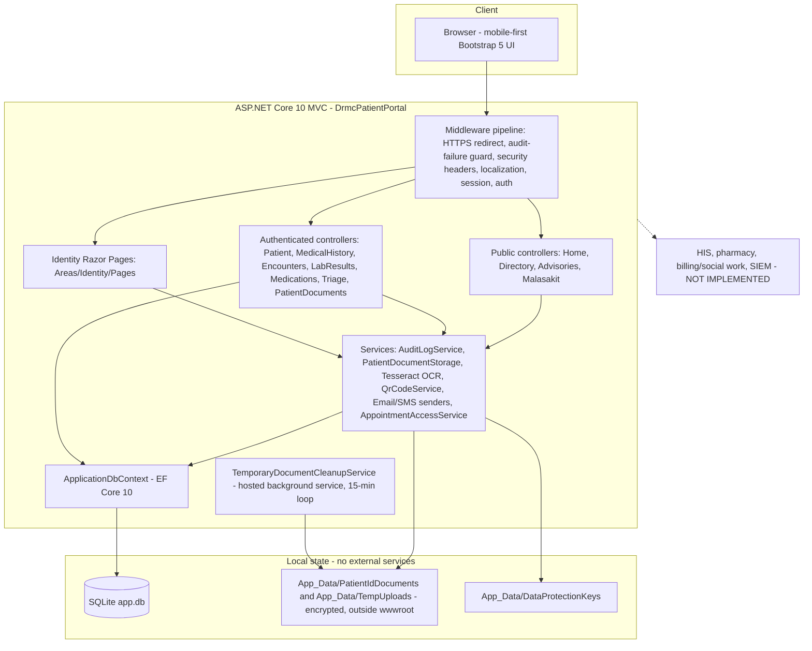
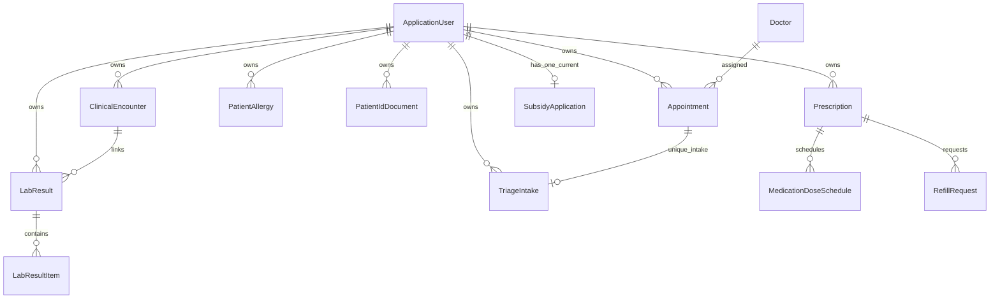

# DRMC Patient Portal

A patient-facing web portal for **Davao Regional Medical Center (DRMC)**, built on **ASP.NET Core 10 MVC** with **Entity Framework Core 10 + SQLite**.

The portal gives the public hospital information (departments, OPD guidance, advisories, financial-assistance guidance) and gives registered patients audited access to their own clinical records (encounters, medical history, laboratory results, medications), a digital pre-consultation triage intake, a locally saved Malasakit / financial-assistance application, encrypted government-ID document handling, and a personal access-history log.

> **Read this first if you are new to the project:** this repository is a *patient-only* portal. It contains **no** clinician workstation, no hospital information system (HIS) adapter, no pharmacy adapter, no billing/social-work adapter, and no SIEM connection. Every state shown to a patient is either patient-entered or seeded/stored locally. Nothing in this repository claims that data was accepted, synchronized, dispensed, or approved by DRMC. See [Integration boundaries](#integration-boundaries).

---

## Table of contents

1. [Who this document is for](#who-this-document-is-for)
2. [Product scope at a glance](#product-scope-at-a-glance)
3. [Technology stack](#technology-stack)
4. [Architecture](#architecture)
5. [Repository structure](#repository-structure)
6. [Domain and data model](#domain-and-data-model)
7. [Route map](#route-map)
8. [Request lifecycle](#request-lifecycle)
9. [Security model](#security-model)
10. [Localization](#localization)
11. [Configuration reference](#configuration-reference)
12. [Running locally](#running-locally)
13. [Build, test, and validation](#build-test-and-validation)
14. [Database migrations](#database-migrations)
15. [Deployment](#deployment)
16. [Integration boundaries](#integration-boundaries)
17. [Contributing and conventions](#contributing-and-conventions)
18. [Documentation index](#documentation-index)

---

## Who this document is for

| Reader | Start here |
|---|---|
| **New developer on this codebase** | [Architecture](#architecture) → [Repository structure](#repository-structure) → [Running locally](#running-locally) |
| **DRMC / client stakeholder** | [Product scope at a glance](#product-scope-at-a-glance) → [Integration boundaries](#integration-boundaries) → [Security model](#security-model) |
| **Client-side developer or integrator** | [Domain and data model](#domain-and-data-model) → [Route map](#route-map) → [Integration boundaries](#integration-boundaries) |
| **Operations / deployment engineer** | [Configuration reference](#configuration-reference) → [Database migrations](#database-migrations) → [Deployment](#deployment) |

---

## Product scope at a glance

### Public (no sign-in required)

| Capability | Behavior |
|---|---|
| Landing page | Public-first entry point with hospital services and clinical departments available before the bottom-of-page sign-in/register card (`ClinicalDepartments`, static in-code catalog) |
| OPD guide | Step-by-step, on-site outpatient flow per facility (`OpdGuideFlows`, static in-code content) |
| Doctor / department directory | Filter and search active doctors from the database by department, name, sub-specialty, clinic room, and teleconsult availability |
| Public advisories | Category + keyword search, pinned urgent alerts, per-advisory view counter |
| Malasakit / financial-assistance guidance | Program hub, per-program pages (MAIP, PhilHealth, PCSO, DSWD AICS, DRMC Malasakit, DOH-MAIFIP), and direct document-requirement guides for the services handled at the Malasakit Center |
| Official DRMC references | Direct links to the publisher's live ARTA and Citizen's Charter landing pages (`OfficialDrmcSources`) — no scraping, no republished PDFs |
| Language switcher | English, Filipino, Cebuano via a persisted culture cookie |

### Authenticated patient

| Capability | Behavior |
|---|---|
| Dashboard | Own encounters, lab results, active prescription count, and current subsidy application |
| Medical history | Own encounters grouped into `OPD` / `ER` / `ADMITTED`; owner-scoped, audited, `NoStore` |
| Encounters | Own encounter list (optional department filter) and detail view with linked lab results; detail views are audited |
| Laboratory results | Own results with category filter and keyword search; detail views include result items and are audited |
| Medications | Own prescriptions with persisted exact dose schedules and allergy list; detail views are audited |
| Triage intake | Validated digital pre-consultation intake with 0–10 pain scale, symptoms, comorbidities, reported vitals, and an emergency red-flag path that persists `UrgentEmergency` **before** the warning screen is shown |
| Malasakit application | One current application per patient, a document-preparation checklist, and clearly separated *patient-reported* versus *hospital-confirmed* payment/eligibility/coverage states |
| Government-ID documents | Owner-only ID wallet with saved ID details, masked reference numbers, encrypted JPEG/PNG image retrieval, front/back preview, and zoom; image reads are audited |
| Access history | The patient's own most recent 50 audit entries |

### Deliberately **not** implemented

- **Online appointment booking and check-in** — retired per client directive. `AppointmentsController` is intentionally kept as a stub whose every action returns `404`, and it is hidden from API discovery. Outpatient visits follow the physical OPD guide. The `Appointment` entity remains in the schema because triage and historical records reference it.
- **Online OPD queue tracking** — removed (migration `20260916095804_RemoveOpdQueue`); DRMC has no queue source of truth.
- **Laboratory biomarker trends** — removed; the underlying `LabResultItem` data is still used for full report details.
- **Secure messaging and caregiver / proxy access** — removed and not routed.
- **Refill submission endpoint** — `RefillRequest` exists in the data model and is surfaced read-only; there is no refill POST action in the current controller set, and no dispensing or inventory effect anywhere.
- **HIS, pharmacy, billing/social-work, and SIEM adapters** — absent by design.

---

## Technology stack

| Layer | Choice |
|---|---|
| Runtime / framework | .NET 10 (`net10.0`), ASP.NET Core MVC + Razor Views |
| Identity | ASP.NET Core Identity with a custom `ApplicationUser`, scaffolded Identity UI under `Areas/Identity/Pages` |
| Persistence | EF Core 10 + SQLite (`Microsoft.EntityFrameworkCore.Sqlite`), code-first migrations |
| Encryption | ASP.NET Core Data Protection (file-system key ring) for ID images and staging tokens |
| OCR | `Tesseract` 5.2 + `Tesseract.Data.English` for offline government-ID field extraction |
| QR codes | `QRCoder` 1.8 (`QrCodeService`, vector SVG, capability URL only) |
| Front end | Bootstrap 5, locally vendored Bootstrap Icons, jQuery + unobtrusive validation (`libman.json`); no remote CDN, no remote fonts |
| Localization | `.resx` resources for `en`, `fil`, `ceb` with view + data-annotation localization |
| Tests | xUnit, EF Core InMemory, Moq (unit) and Microsoft Playwright (Chromium / Firefox / WebKit browser suite) |
| Solution format | `DrmcPatientPortal.slnx` (XML solution) |

---

## Architecture

The application is a single deployable ASP.NET Core MVC server-rendered web app. There is no separate SPA, no public API surface, and no background worker process other than one in-process hosted service.



### Architectural rules the code follows

1. **Controller-per-feature, view model in the controller file.** Each controller declares its own view models at the bottom of the same file (for example `EncountersIndexViewModel`, `MedicationsIndexViewModel`). There is no separate ViewModels folder and no service/repository layer between controllers and `ApplicationDbContext`.
2. **Owner scoping is done in the query, not in the view.** Every authenticated read filters on `PatientUserId == user.Id` and returns `NotFound()` for records the caller does not own. `UserManager.GetUserAsync(User)` returning `null` results in `Challenge()`.
3. **PHI access is audited, and auditing fails closed.** `AuditLogService.LogAsync` throws `AuditLogPersistenceException` when the audit row cannot be written; middleware converts that into a redirect to a localized `503` page. Clinical mutations (triage) wrap save + audit in a transaction and roll back together.
4. **Authoritative outcomes never come from form input.** `SubsidyApplication.Eligibility`, `Coverage`, `ConfirmedPayment`, `ReviewedAt`, and `ReviewNotes` are not bindable from the patient form; they stay at their unconfirmed defaults until an approved institutional workflow supplies them.
5. **Patient files never live under `wwwroot`.** They are Data-Protection-encrypted, given server-generated names, path-canonicalized, and served only through the authorized `PatientDocuments` endpoint.
6. **Static reference content lives in code, not in the database.** `ClinicalDepartments`, `OpdGuideFlows`, `PhilippineIdTypes`, and `OfficialDrmcSources` are strongly typed catalogs in `Models/`.
7. **Retired features are explicitly neutralized, not silently deleted.** `AppointmentsController` keeps its shape but returns `404` from every action, with a comment explaining why. This keeps history readable and prevents accidental reactivation.

---

## Repository structure

```text
drmc-patient-portal/
├── DrmcPatientPortal.slnx              # Solution: 1 web project + 2 test projects
├── README.md                           # This document
├── STATUS.md                           # Source of truth for what is implemented today
├── run.ps1                             # Convenience launcher (resolves dotnet, runs the web project)
├── .gitignore                          # Ignores bin/obj/output, *.db, App_Data secrets & documents
│
├── scripts/
│   └── test-ui.ps1                     # Release build + Playwright install + full test run
│
├── docs/
│   ├── CLIENT_REQUIREMENTS_2026-09-13.md   # Latest client requirements + verification report
│   ├── DEPLOYMENT.md                        # Migrations, key ring, notifications, release checks
│   ├── SECURITY_REVIEW_TODO.md              # Implemented controls vs. open institutional work
│   ├── COMPLIANCE_REPORT.md                 # Compliance readiness (not certification)
│   ├── VALIDATION.md                        # UI, accessibility, and signup validation + limits
│   ├── design.md                            # Adopted design system (tokens, layout, a11y rules)
│   ├── ux-notes.md                          # UX decisions
│   ├── opd-guide-content-sources.md         # Provenance of OPD guide content
│   └── screenshots/                         # Reference screenshots used by VALIDATION.md
│
├── src/DrmcPatientPortal/              # The web application
│   ├── Program.cs                      # DI registration + middleware pipeline (single entry point)
│   ├── DrmcPatientPortal.csproj        # net10.0, NuGet references, user-secrets id
│   ├── appsettings.json                # Connection string, document/key paths, notification sections
│   ├── appsettings.Development.json    # Development overrides
│   ├── libman.json                     # Client-side library acquisition (Bootstrap, icons, jQuery)
│   ├── SharedResource.cs               # Marker type for shared localization resources
│   │
│   ├── Controllers/
│   │   ├── HomeController.cs           # /, /OpdGuide, Privacy, ServiceUnavailable, SetLanguage, Error
│   │   ├── DirectoryController.cs      # Doctor & department directory
│   │   ├── AdvisoriesController.cs     # Public advisories list/detail (+ view counter)
│   │   ├── MalasakitController.cs      # Program hub, requirement guides, Apply/Status/Requirements
│   │   ├── PatientController.cs        # Patient dashboard + access history
│   │   ├── MedicalHistoryController.cs # OPD/ER/ADMITTED grouping over owned encounters
│   │   ├── EncountersController.cs     # Encounter list + audited detail with linked labs
│   │   ├── LabResultsController.cs     # Lab list (filter/search) + audited detail
│   │   ├── MedicationsController.cs    # Prescriptions, dose schedules, allergies + audited detail
│   │   ├── TriageController.cs         # Digital intake, red-flag interception, summary
│   │   ├── PatientDocumentsController.cs # Owner-only encrypted ID image retrieval + legacy migration
│   │   └── AppointmentsController.cs   # RETIRED stub: every action returns 404
│   │
│   ├── Models/                         # EF entities, enums, and static reference catalogs
│   ├── Data/
│   │   ├── ApplicationDbContext.cs     # DbSets, relationships, indexes, delete behavior
│   │   ├── DbInitializer.cs            # Idempotent Development seeding (users, clinical data, content)
│   │   └── Migrations/                 # Code-first migration chain + model snapshot
│   │
│   ├── Services/
│   │   ├── IAuditLogService.cs / AuditLogService.cs        # Fail-closed PHI audit writes
│   │   ├── AuditLogPersistenceException.cs                 # Signals an audit write failure
│   │   ├── PatientDocumentStorage.cs                       # Encrypt/stage/commit/read/migrate ID files
│   │   │                                                   # + TemporaryDocumentCleanupService
│   │   ├── TesseractIdDocumentExtractionService.cs         # Offline OCR field extraction per ID type
│   │   ├── IQrCodeService.cs / QrCodeService.cs            # SVG QR for capability URLs only
│   │   ├── AppointmentAccessService.cs                     # Hashed capability tokens (legacy surface)
│   │   ├── ConsoleEmailSender.cs / ConsoleSmsSender.cs     # Development-only notification senders
│   │   └── ProductionNotificationSenders.cs                # SMTP + HTTPS SMS webhook adapters
│   │
│   ├── Views/                          # Razor views, one folder per controller, plus Shared/
│   │   └── Shared/                     # _Layout, _MobileNavigation, _LoginPartial,
│   │                                   # _OfficialDrmcSources, _PrivacyNotice, _PortalTerms, Error
│   ├── Areas/Identity/Pages/           # Scaffolded Identity UI (register, login, 2FA, account)
│   ├── Resources/                      # SharedResource.en.resx / .fil.resx / .ceb.resx (key parity)
│   ├── Properties/                     # launchSettings.json
│   └── wwwroot/                        # css/, js/, images/, lib/ (Bootstrap, Bootstrap Icons, jQuery)
│
└── tests/
    ├── DrmcPatientPortal.Tests/            # xUnit unit/integration tests (EF InMemory + Moq)
    │   ├── ClientRequirementsTests.cs      # Latest client-requirement behavior
    │   ├── Phase3AuthenticatedFeaturesTests.cs # Owner scoping, clinical flows
    │   ├── Phase3GovernanceTests.cs        # Consent/governance behavior
    │   ├── SecurityHardeningTests.cs       # Lockout, headers, fail-closed audit paths
    │   └── IdDocumentRegistrationTests.cs  # Registration, ID capture, encrypted storage
    │
    └── DrmcPatientPortal.BrowserTests/     # Playwright suite (Chromium / Firefox / WebKit)
        ├── PortalFixture.cs                # Boots an isolated server: temp SQLite DB, key ring, doc dirs
        ├── ResponsiveTests.cs              # Desktop/tablet/phone matrix down to 320px
        ├── AccessibilityTests.cs           # Automated WCAG AA checks
        ├── WorkflowTests.cs                # End-to-end patient journeys
        ├── SignupTests.cs                  # Registration + ID capture in a real browser
        ├── ClientRequirementsTests.cs      # Client-requirement UI verification
        └── OpdGuideTests.cs                # OPD guide content and navigation
```

**Runtime-only paths (git-ignored, never commit):** `src/DrmcPatientPortal/App_Data/PatientIdDocuments/`, `App_Data/TempUploads/`, `App_Data/DataProtectionKeys/`, `app.db`, and `output/` (Playwright screenshots, TRX results).

---

## Domain and data model

`ApplicationDbContext` extends `IdentityDbContext<ApplicationUser>`. All patient-owned entities cascade from the owning user.



### Entity reference

| Entity | Purpose | Notable constraints |
|---|---|---|
| `ApplicationUser` | Identity user plus patient profile: names, contact, ID type/number, privacy consent, demographics (DOB, address, sex, blood type) | Unique email; 8+ char password with upper/lower/digit/symbol |
| `ClinicalEncounter` | OPD / teleconsult / ER / inpatient visit with diagnoses, clinical summary, care plan, vitals, follow-up | Unique `EncounterReference`; indexed by patient |
| `LabResult` + `LabResultItem` | Laboratory report header and individual analytes | Indexed by patient, encounter, accession; encounter link uses `SetNull` |
| `Prescription` + `MedicationDoseSchedule` | Active/past prescriptions and persisted exact dose times | Unique `RxNumber`; unique `(PrescriptionId, DoseTime)` |
| `RefillRequest` | Locally recorded refill state; no dispensing effect | Indexed by patient |
| `PatientAllergy` | Allergy list shown alongside medications | Indexed by patient |
| `TriageIntake` | Pre-consultation intake: complaint, duration, 0–10 pain scale, symptoms/comorbidities, reported vitals, acuity, red-flag marker | **Unique `AppointmentId`** — one intake per appointment |
| `SubsidyApplication` | One current Malasakit application per patient, plus document-preparation flags | **Unique `PatientUserId`** — DB-enforced duplicate prevention, including concurrent submits |
| `PatientIdDocument` | Government-ID metadata: ID type, captured-at, encrypted file names, MIME types, `StorageVersion` | Indexed by patient, ID type, captured-at |
| `AuditLog` | Access-transparency and security events (`UserId`, `Action`, `Resource`, `Details`, `IpAddress`, `Timestamp`) | Indexed by user and timestamp |
| `Appointment` | Legacy/seeded appointment records retained for triage and history | Unique `BookingReference`; booking routes are retired |
| `Doctor`, `ClinicalDepartment`, `AssistanceProgram`, `PublicAdvisory` | Public reference content | Unique `AssistanceProgram.Code`, unique `PublicAdvisory.Slug` |

### Enums worth knowing

- `EncounterType`: `OpdConsultation`, `Teleconsultation`, `Emergency`, `Inpatient` — mapped to the `OPD` / `ER` / `ADMITTED` history categories (teleconsultations group with OPD and keep their original label).
- `TriageAcuity`: `Routine`, `Priority`, `UrgentEmergency`.
- `SubsidyNeed`: `Medicines`, `Diagnostics`, `HospitalCare`.
- `SubsidyEligibility`: `PendingReview`, `RequirementsNeeded`, `Eligible`, `Ineligible`.
- `SubsidyCoverage`: `Unconfirmed`, `Subsidised`, `PartiallySubsidised`, `SelfPay`.
- `BillPaymentStatus`: `Unconfirmed`, `Unpaid`, `PartiallyPaid`, `Paid` — tracked **twice**, once as patient-reported and once as hospital-confirmed.

---

## Route map

Routing is conventional (`{controller=Home}/{action=Index}/{id?}`) plus attribute routes on the patient-facing controllers, and Razor Pages for Identity.

### Public

| Method | Route | Purpose |
|---|---|---|
| GET | `/` | Landing page with department overview |
| GET | `/OpdGuide` (also `/Home/OpdGuide`) | On-site outpatient guidance per facility |
| GET | `/Home/Privacy` | Privacy notice |
| GET | `/Home/ServiceUnavailable` | Localized `503` shown when an audit write fails |
| GET | `/Home/Error` | Generic error page with request id |
| POST | `/Home/SetLanguage` | Sets the `en` / `fil` / `ceb` culture cookie (antiforgery + local-redirect only) |
| GET | `/Directory` | Doctor directory (`department`, `search`, `teleconsultOnly`) |
| GET | `/Directory/Doctor/{id}` | Doctor profile |
| GET | `/Directory/Department/{name}` | Department detail with its doctors |
| GET | `/Advisories` | Advisory list (`category`, `search`, pinned urgent alert) |
| GET | `/Advisories/Details/{slug}` | Advisory detail (increments view count) |
| GET | `/Malasakit` | Assistance program hub |
| GET | `/Malasakit/Program/{code}` | Program detail (`MAIP`, `PHILHEALTH`, `PCSO`, `DSWD_AICS`, `MALASAKIT`) |
| GET | `/Malasakit/DRMCMalasakitServices`, `/Malasakit/DSWDServices`, `/Malasakit/MaifipRequirements`, `/Malasakit/Philhealth` | Requirement checklists per program |
| — | `/Identity/Account/*` | Four-step government-ID registration, login, logout, 2FA, and account management (Razor Pages); signup requires scroll-gated privacy/terms consent |

### Authenticated patient (`[Authorize]`)

| Method | Route | Purpose |
|---|---|---|
| GET | `/Patient/Home` | Dashboard: encounters, labs, active prescriptions, subsidy status |
| GET | `/Patient/Audit` | Own last 50 audit entries |
| GET | `/Identity/Account/Manage/MyIds` | Own saved government IDs with masked details and secure front/back image preview |
| GET | `/Patient/MedicalHistory?category=OPD\|ER\|ADMITTED` | Owned history; audited, `NoStore`; invalid category returns `400` |
| GET | `/Patient/Encounters?department=` | Owned encounter timeline |
| GET | `/Patient/Encounters/Details/{id}` | Owned encounter + linked labs (audited) |
| GET | `/Patient/LabResults?category=&search=` | Owned laboratory results |
| GET | `/Patient/LabResults/Details/{id}` | Owned result with items (audited) |
| GET | `/Patient/Medications` | Prescriptions, dose schedules, allergies |
| GET | `/Patient/Medications/Details/{id}` | Owned prescription (audited) |
| GET | `/Patient/Triage/Start/{appointmentId}` | Intake form for an owned appointment |
| POST | `/Patient/Triage/Submit` | Persists intake; red flags persist `UrgentEmergency` then redirect |
| GET | `/Patient/Triage/Summary/{id}` | Owned intake summary |
| GET | `/Patient/Triage/EmergencyWarning` | Emergency guidance screen |
| GET/POST | `/Malasakit/Apply` | Create the current application (repeat visits redirect to Status) |
| GET | `/Malasakit/Status` | Own application, eligibility, coverage, reported vs. confirmed payment (audited, `NoStore`) |
| POST | `/Malasakit/Requirements` | Save the document-preparation checklist |
| GET | `/PatientDocuments/IdPhoto/{id}?side=front\|back` | Owner-only decrypted ID image (audited, `no-store`; lazily migrates legacy plaintext) |

### Retired (returns `404` by design)

`/Appointments/Book`, `/Appointments/Access`, `/Appointments/Confirmation`, `/Appointments/CheckIn`, `/Appointments/Cancel`, `/Appointments/Api/Doctors`, `/Appointments/Api/AvailableSlots`.

> **Note for integrators:** because booking is retired, `/Patient/Triage/Start/{appointmentId}` is only reachable for appointments that already exist in the database (for example Development seeds or historical rows). Any future scheduling workflow must recreate an appointment source before triage becomes broadly reachable.

---

## Request lifecycle

The pipeline in `Program.cs`, in order:

1. `UseMigrationsEndPoint` (Development) or `UseExceptionHandler("/Home/Error")` + `UseHsts` (other environments).
2. `UseHttpsRedirection`.
3. **Audit-failure guard** — catches `AuditLogPersistenceException` and redirects to `/Home/ServiceUnavailable` (`503`) when the response has not started.
4. **Security headers** — `X-Content-Type-Options: nosniff`, `X-Frame-Options: SAMEORIGIN`, `Referrer-Policy: no-referrer`, and a self-only CSP (`default-src 'self'`; `img-src 'self' data:`; `frame-ancestors 'self'`; `form-action 'self'`).
5. `UseRouting`.
6. `UseRequestLocalization` — default `en`; providers in order: cookie, query string, `Accept-Language`.
7. `UseSession` — 30-minute idle timeout, HttpOnly, essential, `SameSite=Lax`, secure outside Development. Session binds staged ID uploads during registration.
8. `UseAuthentication` then `UseAuthorization`.
9. `MapStaticAssets`, then the default controller route and Razor Pages.

A typical audited PHI read: `[Authorize]` -> resolve user (`Challenge()` if absent) -> owner-scoped EF query (`NotFound()` if not owned) -> `IAuditLogService.LogAsync(...)` -> render view. If the audit row cannot be written, the request becomes a localized `503` instead of leaking an unaudited record.

---

## Security model

### Implemented in this repository

| Control | Implementation |
|---|---|
| Authentication | ASP.NET Core Identity; unique email; 8+ chars with upper, lower, digit, and non-alphanumeric |
| Brute-force protection | Lockout enabled for new users; 5 failed attempts triggers a 15-minute lockout |
| Cookies | HttpOnly, `SameSite=Lax`, `Secure` always outside Development (both auth and session cookies) |
| Authorization | `[Authorize]` on every patient controller + per-record ownership checks in every query |
| CSRF | `[ValidateAntiForgeryToken]` on all state-changing POSTs |
| PHI auditing | `AuditLog` rows written before the protected response; failures propagate and fail closed |
| Clinical mutation integrity | Triage persistence uses a transaction so intake + audit commit or roll back together |
| Caching | `ResponseCache(NoStore = true)` on medical history, Malasakit Apply/Status, and error pages |
| Document confidentiality | Data Protection encryption (`DRMC.PatientDocuments.File.v2`), server-generated `.idp` names, magic-byte JPEG/PNG verification, Tesseract `Pix` decode check, 10 MB cap, canonical path resolution that rejects traversal, storage outside `wwwroot` |
| Staged uploads | Protected staging token (`DRMC.PatientDocuments.StagingToken.v1`) bound to the session id with a 30-minute expiry; encrypted at rest; removed after commit; a background service sweeps expired files every 15 minutes |
| Legacy migration | Encrypted copy written, metadata committed, then plaintext deleted (in that order) |
| QR privacy | QR payloads contain a capability URL only — never patient identity or complaint data |
| Capability tokens | `AppointmentAccessService` stores only SHA-256 hashes of 32 random bytes, with expiry and revocation |
| Notification boundaries | Console senders **only** in Development; Production fails startup unless SMTP host/port/from and an HTTPS SMS endpoint + API key validate |
| Secrets hygiene | No third-party credentials in the repository; `UserSecretsId` for local secrets; key ring and document paths git-ignored |

### Requires DRMC authority (tracked in [`docs/SECURITY_REVIEW_TODO.md`](docs/SECURITY_REVIEW_TODO.md))

Production Data-Protection key custody, backup, rotation, and DR exercise; DPIA, privacy notice, consent, retention, and ID-image legal basis; independent penetration test and threat model; SMTP/SMS vendor review and credentials; centralized immutable audit/SIEM export with alerting; HIS and pharmacy interface authorization and message contracts; clinical governance sign-off for triage and medication content; formal WCAG 2.2 AA and native-speaker language review; rate limiting / WAF policy; backup-restoration runbook.

> Repository checks are **readiness evidence, not institutional certification**. See [`docs/COMPLIANCE_REPORT.md`](docs/COMPLIANCE_REPORT.md).

---

## Localization

- Supported cultures: **English (`en`, default)**, **Filipino (`fil`)**, **Cebuano (`ceb`)**.
- Keys live in `Resources/SharedResource.{en,fil,ceb}.resx` and are resolved through the `SharedResource` marker type for both views and data annotations.
- **Key parity is a hard requirement**: all three files must contain the same keys with no duplicates (verified in the client-requirements validation run).
- **Patient-entered and clinical-record content is intentionally never machine-translated.** Diagnoses, clinical summaries, lab values, and patient text render verbatim; only shell, navigation, and UI copy are localized.

---

## Configuration reference

Set these through the deployment secret store, environment variables, or user secrets — never committed files.

| Key | Default | Purpose |
|---|---|---|
| `ConnectionStrings:DefaultConnection` | `DataSource=app.db;Cache=Shared` | SQLite database |
| `DataProtection:KeyRingPath` | `App_Data/DataProtectionKeys` | Key ring location. **Back this up** — losing it makes encrypted documents unreadable |
| `PatientDocuments:RootPath` | `App_Data/PatientIdDocuments` | Encrypted ID storage; must stay outside `wwwroot` |
| `PatientDocuments:TemporaryPath` | `App_Data/TempUploads` | Encrypted staging area |
| `PatientDocuments:MaximumFileSizeMb` | `10` | Upload cap |
| `PatientDocuments:TemporaryFileLifetimeMinutes` | `30` | Staging token + file lifetime |
| `Notifications:Email:Host` / `Port` / `UseSsl` / `Username` / `Password` / `FromAddress` | empty / `587` / `true` | SMTP sender. Validated at startup outside Development |
| `Notifications:Sms:Endpoint` / `ApiKey` / `SenderId` | empty / empty / `DRMC` | HTTPS SMS webhook receiving `to`, `message`, `senderId` with bearer auth. Validated at startup outside Development |
| `AllowedHosts` | `*` | Restrict in production |

Relative document and key paths are resolved against the content root and rejected if they escape it.

---

## Running locally

**Prerequisites:** .NET 10 SDK, PowerShell 7+ (`pwsh`) for the helper scripts, and — for the browser suite — Playwright browsers (installed by the script).

```powershell
dotnet restore DrmcPatientPortal.slnx
dotnet ef database update --project src/DrmcPatientPortal/DrmcPatientPortal.csproj
dotnet run --project src/DrmcPatientPortal/DrmcPatientPortal.csproj
```

`run.ps1` does the same thing and also tries to locate `dotnet` on Windows if it is not on `PATH`.

In **Development** only, startup runs `DbInitializer.Initialize`, which idempotently seeds review users, clinical records, doctors, assistance programs, and advisories.

| Seed account | Password | Purpose |
|---|---|---|
| `patient@drmc.doh.gov.ph` | `P@tient2026` | Patient with encounters, lab results, prescriptions |
| `juan@drmc.doh.gov.ph` | `J@uan2026` | New-patient workflow checks |

> **Never** copy seed credentials, seeded clinical data, or a development `app.db` into a deployed environment.

---

## Build, test, and validation

```powershell
dotnet build DrmcPatientPortal.slnx --no-restore
dotnet test  DrmcPatientPortal.slnx --no-build
dotnet list  DrmcPatientPortal.slnx package --vulnerable --include-transitive
```

Full UI validation (Release build, browser install, TRX + screenshots into the ignored `output/playwright/`):

```powershell
pwsh scripts/test-ui.ps1               # add -SkipBrowserInstall after the first run
```

- The browser suite starts its **own** server with a temporary SQLite database, key ring, and document directories (`PortalFixture`). It never touches your normal `app.db` or your running development server.
- Last recorded client validation (September 18): **38 backend tests and 68 browser tests passing** on .NET 10 with no build warnings, across Chromium, Firefox, and WebKit, including a fresh migration chain, an existing-database upgrade, the responsive matrix down to 320px, and automated WCAG AA checks. NuGet reported no known vulnerable packages. Details: [`docs/CLIENT_REQUIREMENTS_2026-09-13.md`](docs/CLIENT_REQUIREMENTS_2026-09-13.md) and [`docs/VALIDATION.md`](docs/VALIDATION.md).
- The OCR image-generation fixture is **Windows-only** because it uses `System.Drawing`; production code itself is platform-neutral.
- Because these figures come from a recorded validation run rather than CI, re-run the commands above to confirm current numbers. There is no GitHub Actions workflow in this repository — verification is local and script-driven.

---

## Database migrations

Code-first EF Core migrations under `src/DrmcPatientPortal/Data/Migrations`, newest last:

| Migration | What it did |
|---|---|
| `00000000000000_CreateIdentitySchema` | Identity baseline |
| `20260825064541_AddPatientProfileFieldsAndDashboardData` | Patient profile + dashboard data |
| `20260825074830_AddRegistrationFields` | Registration fields |
| `20260826013849_AddPhase3PublicHomepageFeatures` | Public homepage content |
| `20260826053655_AddPhase3AuthenticatedFeatures` | Authenticated clinical features |
| `20260826060220_AddPhase3GovernanceConsentLogs` | Consent/governance logging |
| `20260827022305_AddLabResultEncounterLink` | Lab-to-encounter link |
| `20260830053543_AddPatientIdDocumentsAndUserProfileFields` | ID documents + demographics |
| `20260911072633_RemoveEncountersMessagesProxyFeatures` | Removed messaging/proxy (and, temporarily, encounters) |
| `20260912091834_RestoreEncountersAndHardenPortal` | **Forward-only.** Restored `ClinicalEncounters` and `LabResults.ClinicalEncounterId`; added `MedicationDoseSchedules`, document MIME/storage metadata, and the unique appointment-to-triage constraint |
| `20260913120223_AddSubsidyApplications` | `SubsidyApplications` table, owner FK, unique current-application index |
| `20260916095804_RemoveOpdQueue` | Removed OPD queue tracking (**latest**) |

**Rules:** back up before migrating; apply migrations *before* the new application starts; `20260912091834` is forward-only and its SQLite table rebuilds temporarily change `PRAGMA foreign_keys`, so never interrupt it; verify migration history and take a post-deployment backup. Development applies migrations at startup.

---

## Deployment

See [`docs/DEPLOYMENT.md`](docs/DEPLOYMENT.md) for the authoritative runbook. Summary:

1. Back up the database and the Data-Protection key ring.
2. Apply migrations, then start the new build.
3. Configure persistent, access-restricted paths for the key ring and document directories — outside `wwwroot`, readable only by the app identity and approved backup operators.
4. Provide validated SMTP and HTTPS SMS settings; Production **fails to start** without them. Never deploy with console senders.
5. Terminate TLS at a trusted reverse proxy, forward scheme/host safely, force HTTPS, and preserve the secure cookies and self-only CSP.
6. Treat `503` responses and audit-write exceptions during PHI access as security/availability incidents.
7. Smoke-test encounters, medical history, ID retrieval, triage, medications, Malasakit apply/status, language switching, and error telemetry before enabling traffic.

---

## Integration boundaries

This is the section clients and client developers should read most carefully.

| Boundary | Current reality |
|---|---|
| **DRMC HIS** | No adapter. Clinical records are seeded or manually present in the local database. Nothing is fetched from or pushed to a hospital system. |
| **Pharmacy** | No adapter. Refill state is local text; refill counts do not change and nothing is dispensed. |
| **Billing / social work** | No adapter. Malasakit applications are saved **in the portal only**. Eligibility, coverage, and hospital-confirmed payment stay `Unconfirmed` until an approved institutional workflow supplies them. The UI tells patients to bring their reference and documents to the Malasakit Center. |
| **SIEM** | No forwarding. Audit rows live in SQLite; immutable retention and alerting are a DRMC deployment dependency. |
| **SMTP / SMS** | Adapters exist but ship without credentials. Development prints to the console. |
| **Official DRMC content** | ARTA and Citizen's Charter are **outbound links to live landing pages** — no scraping, no embedded third-party scripts, no republished PDFs. If DRMC changes a URL without a redirect, update `OfficialDrmcSources`. |
| **Clinician side** | Out of scope. There is no staff dashboard, no clinician workstation, and no triage review queue. |

**Non-negotiable rule for future contributors:** never label local triage, refill, or subsidy state as *synchronized*, *accepted*, *approved*, or *dispensed* unless a real institutional adapter confirmed it. Guidance content must not be presented as an eligibility decision.

---

## Contributing and conventions

- **Language/style:** C# on .NET 10 with `Nullable` and `ImplicitUsings` enabled. Prefer primary constructors for new controllers (see `MedicalHistoryController`) and constructor injection elsewhere.
- **Where code goes:** entities and static catalogs in `Models/`, data access in `Data/`, cross-cutting logic in `Services/`, view models at the bottom of the owning controller file.
- **Every new authenticated read** must be owner-scoped in the query and, if it exposes PHI, audited through `IAuditLogService`.
- **Every new POST** needs `[ValidateAntiForgeryToken]` and server-side validation; never bind authoritative or ownership fields from form input.
- **Schema changes** require an EF migration plus a note in `STATUS.md`; EF must report no model changes missing a migration.
- **UI changes** follow [`docs/design.md`](docs/design.md): existing DRMC tokens in `wwwroot/css/site.css`, Bootstrap 5 components, locally vendored icons, no new UI framework, no remote fonts or CDNs, mobile baseline at 320px with 44px touch targets and the five fixed primary destinations (Home, Encounters, Results, Medication, Malasakit).
- **New UI strings** must be added to all three `.resx` files in the same change.
- **Before opening a PR:** run the build, the unit tests, `pwsh scripts/test-ui.ps1`, and the vulnerable-package audit; never commit `app.db`, `App_Data/`, or `output/`.
- **Workflow:** feature branches merged into `master` via pull request (recent history shows both maintainer and collaborator PRs). `master` is the default branch and is protected.

---

## Documentation index

| Document | Use it for |
|---|---|
| [`STATUS.md`](STATUS.md) | **Source of truth** for what is implemented, what is deliberately not, and the latest migration |
| [`docs/CLIENT_REQUIREMENTS_2026-09-13.md`](docs/CLIENT_REQUIREMENTS_2026-09-13.md) | Latest client requirements, route decisions, and the verification report |
| [`docs/DEPLOYMENT.md`](docs/DEPLOYMENT.md) | Migrations, key ring, document paths, notifications, release checks |
| [`docs/SECURITY_REVIEW_TODO.md`](docs/SECURITY_REVIEW_TODO.md) | Implemented controls vs. open institutional security work |
| [`docs/COMPLIANCE_REPORT.md`](docs/COMPLIANCE_REPORT.md) | Compliance readiness (not certification) |
| [`docs/VALIDATION.md`](docs/VALIDATION.md) | UI, accessibility, and signup validation coverage, results, and known limits |
| [`docs/design.md`](docs/design.md) and [`docs/ux-notes.md`](docs/ux-notes.md) | Design system, tokens, layout, accessibility rules, UX decisions |
| [`docs/opd-guide-content-sources.md`](docs/opd-guide-content-sources.md) | Provenance of OPD guide content |

When documents disagree, precedence is: **code, then `STATUS.md`, then the latest client requirements, then everything else.**

Historical planning documents (phase plans, phase logs, the acceptance-gauntlet record, and the internal critique rubric) were removed during repository cleanup. They remain in git history if you need them.
