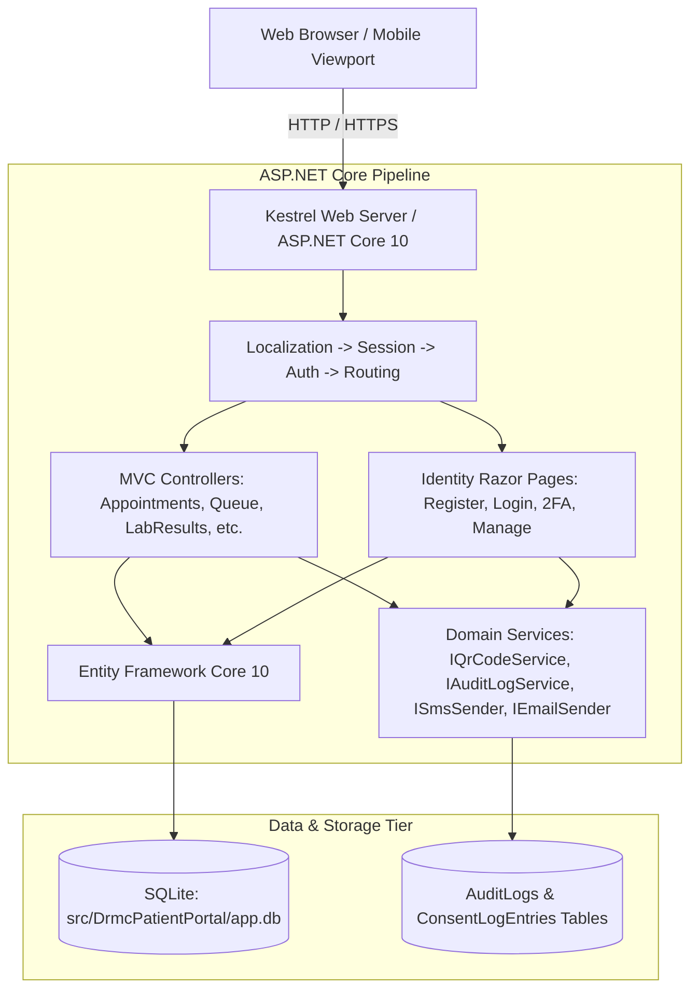

# Davao Regional Medical Center (DRMC) — Patient Portal

[](https://dotnet.microsoft.com/)
[](https://learn.microsoft.com/aspnet/core)
[-003b57.svg)](https://www.sqlite.org/)
[](https://getbootstrap.com/)
[](https://www.w3.org/WAI/standards-guidelines/wcag/)
[](file:///c:/Users/User/Documents/1Random%20Works/Drmc%20V2/drmc-patient-portal/tests/DrmcPatientPortal.Tests)

A comprehensive patient-facing web application and clinical health information portal engineered for **Davao Regional Medical Center (DRMC)** — a Level III Department of Health (DOH) Teaching and Training Tertiary Hospital located in Tagum City, Davao del Norte, Philippines (1,000-bed authorized capacity; serving Davao del Norte, Davao del Sur, Davao Oriental, and Davao de Oro).

Hospital Tagline: **"Caring for Life, Changing Lives."**

---

## Table of Contents

1. [Architectural Overview](#architectural-overview)
2. [Quickstart & How to Run](#quickstart--how-to-run)
3. [Seeded Accounts (Development Logins)](#seeded-accounts-development-logins)
4. [Complete Feature & Route Catalog](#complete-feature--route-catalog)
   - [Public Outpatient & Hospital Services](#1-public-outpatient--hospital-services)
   - [Authenticated Patient Clinical Portal](#2-authenticated-patient-clinical-portal)
   - [Identity, Security & Governance Subsystems](#3-identity-security--governance-subsystems)
5. [Key Subsystems & Architecture Details](#key-subsystems--architecture-details)
   - [Database & EF Core Concurrency](#database--ef-core-concurrency)
   - [Trilingual Localization (en / fil / ceb)](#trilingual-localization-en--fil--ceb)
   - [In-Process Vector QR Generation](#in-process-vector-qr-generation)
   - [Two-Factor Authentication (2FA TOTP)](#two-factor-authentication-2fa-totp)
   - [PHI Audit Logging & Consent Tracking](#phi-audit-logging--consent-tracking)
   - [Low-Bandwidth & Mobile Optimization](#low-bandwidth--mobile-optimization)
6. [Developer Workflows (How-To Guides)](#developer-workflows-how-to-guides)
   - [Adding a New Clinical Controller & View](#adding-a-new-clinical-controller--view)
   - [Creating and Applying Database Migrations](#creating-and-applying-database-migrations)
   - [Adding Localized UI Strings](#adding-localized-ui-strings)
   - [Running and Writing Automated Tests](#running-and-writing-automated-tests)
   - [Resetting the Local Database](#resetting-the-local-database)
7. [Repository Layout](#repository-layout)
8. [Statutory & Institutional Compliance](#statutory--institutional-compliance)
9. [Security Hardening & Production Roadmap](#security-hardening--production-roadmap)

---

## Architectural Overview

The DRMC Patient Portal is built on modern, lightweight, and standards-compliant technologies:

- **Runtime & Web Framework:** **.NET 10** (ASP.NET Core MVC with Razor Pages for Identity).
- **ORM & Data Persistence:** **Entity Framework Core 10** with **SQLite** (`DataSource=app.db;Cache=Shared`).
- **Authentication & Security:** **ASP.NET Core Identity** with TOTP Two-Factor Authentication (MFA), password hashing, brute-force lockout, and session management.
- **Frontend & Styling:** **Bootstrap 5.3.8** (managed via LibMan) styled using CSS custom properties (`:root` variables) strictly mapped to the Philippine Government Website Template Design (GWTD) and DRMC brand identity (`#0d4e86` brand blue).
- **Vector QR Code Engine:** In-process vector SVG generation via **QRCoder 1.8.0** with zero external network dependencies.
- **Localization Engine:** Trilingual localization for English (`en`), Filipino/Tagalog (`fil`), and Davao Cebuano/Bisaya (`ceb`) with clinical lay terminology.
- **Automated Testing:** **xUnit 2.9.3** and **Moq 4.20.72** with EF Core In-Memory database isolation.



---

## Quickstart & How to Run

### Prerequisites
- **[.NET 10 SDK](https://dotnet.microsoft.com/download/dotnet/10.0)** (v10.0.100 or higher).
- Windows, Linux, or macOS terminal.

### Option A: Windows (Batch / PowerShell)
From the repository root:

```cmd
:: Using the quick launcher batch script:
run.bat

:: Or using PowerShell:
.\run.ps1

:: Or via standard dotnet CLI:
cd src\DrmcPatientPortal
dotnet run
```

### Option B: Linux / macOS (Bash / Zsh)
```bash
# Set up environment if needed (or ensure dotnet is on PATH)
source .dotnet-env.sh

# Navigate to project and run
cd src/DrmcPatientPortal
dotnet run
```

### Access the Application
Once started, the console will output the active URLs:
- **HTTP:** `http://localhost:5095`
- **HTTPS:** `https://localhost:7104`

Open `http://localhost:5095` in your browser.

> [!NOTE]
> **Zero Database Setup Required:** In `Development` mode, `DbInitializer.Initialize(...)` automatically applies all pending EF Core migrations and seeds realistic clinical data (doctors, queue tickets, advisories, lab results, prescriptions, encounters, and test accounts).

---

## Seeded Accounts (Development Logins)

These accounts are initialized automatically when running in `Development`. **Documented here for developers and QA only — never exposed anywhere in the rendered UI.**

| Email | Password | Name | Persona / Data Context |
|---|---|---|---|
| `patient@drmc.doh.gov.ph` | `P@tient2026` | Maria Clara D. Santos | **Primary Patient Account:** Preloaded with confirmed OPD appointments, waiting queue ticket (`IM-105`), multi-analyte lab results (CBC, FBS, Lipid Profile, HbA1c), active prescriptions (Metformin, Losartan), penicillin allergy alert, clinical encounters with ICD-10 notes, care team message threads, 2 dependent profiles with statutory consent logs, and audit logs. |
| `juan@drmc.doh.gov.ph` | `J@uan2026` | Juan Miguel A. Dela Cruz | **Clean Patient Account:** Bare account for testing new appointment bookings, initial 2FA setup, first-time triage intake, and registration workflows. |

---

## Complete Feature & Route Catalog

### 1. Public Outpatient & Hospital Services

| Route | Controller Action | Description |
|---|---|---|
| `/` | [`HomeController.Index`](file:///c:/Users/User/Documents/1Random%20Works/Drmc%20V2/drmc-patient-portal/src/DrmcPatientPortal/Controllers/HomeController.cs) | DRMC landing portal featuring real hospital statistics, 8 clinical departments, interactive service links, and quick entry points. |
| `/OpdGuide` | [`HomeController.OpdGuide`](file:///c:/Users/User/Documents/1Random%20Works/Drmc%20V2/drmc-patient-portal/src/DrmcPatientPortal/Controllers/HomeController.cs) | Plain-language, unauthenticated outpatient orientation guide with a 6-step linear visual stepper and referral to the lobby wayfinder kiosk. |
| `/Queue` | [`QueueController.Index`](file:///c:/Users/User/Documents/1Random%20Works/Drmc%20V2/drmc-patient-portal/src/DrmcPatientPortal/Controllers/QueueController.cs) | Real-time Outpatient Department (OPD) queue tracker across all 8 clinical departments with department tabs and currently called ticket numbers. |
| `/Queue/Status?ticketNumber={num}` | [`QueueController.Status`](file:///c:/Users/User/Documents/1Random%20Works/Drmc%20V2/drmc-patient-portal/src/DrmcPatientPortal/Controllers/QueueController.cs) | Instant queue ticket position lookup displaying estimated wait minutes and clinic room assignment. |
| `/Queue/Live` | [`QueueController.Live`](file:///c:/Users/User/Documents/1Random%20Works/Drmc%20V2/drmc-patient-portal/src/DrmcPatientPortal/Controllers/QueueController.cs) | AJAX polling endpoint for the queue ticker board. Includes low-bandwidth throttling via Page Visibility API. |
| `/Appointments/Book` | [`AppointmentsController.Book`](file:///c:/Users/User/Documents/1Random%20Works/Drmc%20V2/drmc-patient-portal/src/DrmcPatientPortal/Controllers/AppointmentsController.cs) | Multi-step booking wizard with real-time doctor selection, specialty filtering, slot conflict protection, and patient data binding. |
| `/Appointments/Confirmation?reference={ref}` | [`AppointmentsController.Confirmation`](file:///c:/Users/User/Documents/1Random%20Works/Drmc%20V2/drmc-patient-portal/src/DrmcPatientPortal/Controllers/AppointmentsController.cs) | Digital appointment confirmation slip featuring an in-process vector SVG QR triage check-in pass. |
| `/Appointments/CheckIn/{reference}` | [`AppointmentsController.CheckIn`](file:///c:/Users/User/Documents/1Random%20Works/Drmc%20V2/drmc-patient-portal/src/DrmcPatientPortal/Controllers/AppointmentsController.cs) | Hospital triage desk QR scan landing page for physical triage validation. |
| `/Directory` | [`DirectoryController.Index`](file:///c:/Users/User/Documents/1Random%20Works/Drmc%20V2/drmc-patient-portal/src/DrmcPatientPortal/Controllers/DirectoryController.cs) | Roster of 16 attending medical specialists across all 8 clinical departments with subspecialty search and teleconsultation filters. |
| `/Directory/Doctor/{id}` | [`DirectoryController.Doctor`](file:///c:/Users/User/Documents/1Random%20Works/Drmc%20V2/drmc-patient-portal/src/DrmcPatientPortal/Controllers/DirectoryController.cs) | Detailed specialist profile view with clinic room, schedule, PRC license masking, and direct appointment booking CTA. |
| `/Directory/Department?name={name}` | [`DirectoryController.Department`](file:///c:/Users/User/Documents/1Random%20Works/Drmc%20V2/drmc-patient-portal/src/DrmcPatientPortal/Controllers/DirectoryController.cs) | Clinical department overview highlighting services offered, chairperson information, local telephone extension, and affiliated medical staff. |
| `/Malasakit` | [`MalasakitController.Index`](file:///c:/Users/User/Documents/1Random%20Works/Drmc%20V2/drmc-patient-portal/src/DrmcPatientPortal/Controllers/MalasakitController.cs) | Comprehensive guide to DRMC Malasakit Center under Republic Act No. 11463 (MAIP, PhilHealth, PCSO IMAP, DSWD AICS). |
| `/Malasakit/Navigator` | [`MalasakitController.Navigator`](file:///c:/Users/User/Documents/1Random%20Works/Drmc%20V2/drmc-patient-portal/src/DrmcPatientPortal/Controllers/MalasakitController.cs) | Interactive 3-step citizen assistance assessment wizard. |
| `/Malasakit/Assess` | [`MalasakitController.Assess`](file:///c:/Users/User/Documents/1Random%20Works/Drmc%20V2/drmc-patient-portal/src/DrmcPatientPortal/Controllers/MalasakitController.cs) | Generated personalized documentary requirement checklist and institutional safety-net coverage estimate. |
| `/Malasakit/Program/{code}` | [`MalasakitController.Program`](file:///c:/Users/User/Documents/1Random%20Works/Drmc%20V2/drmc-patient-portal/src/DrmcPatientPortal/Controllers/MalasakitController.cs) | Detailed requirements, legal basis, and application procedure for specific assistance programs (e.g. `MAIP`, `PHILHEALTH`). |
| `/Advisories` | [`AdvisoriesController.Index`](file:///c:/Users/User/Documents/1Random%20Works/Drmc%20V2/drmc-patient-portal/src/DrmcPatientPortal/Controllers/AdvisoriesController.cs) | Public health advisories, hospital announcements, vaccination schedules, and pinned urgent health alerts. |
| `/Advisories/Details/{slug}` | [`AdvisoriesController.Details`](file:///c:/Users/User/Documents/1Random%20Works/Drmc%20V2/drmc-patient-portal/src/DrmcPatientPortal/Controllers/AdvisoriesController.cs) | Full article view with real-time view counter increments and official DRMC issuing authority signature. |

---

### 2. Authenticated Patient Clinical Portal

All authenticated routes require login (`[Authorize]`) and enforce strict patient data isolation.

| Route | Controller Action | Description |
|---|---|---|
| `/Patient/Home` | [`PatientController.Home`](file:///c:/Users/User/Documents/1Random%20Works/Drmc%20V2/drmc-patient-portal/src/DrmcPatientPortal/Controllers/PatientController.cs) | Unified patient dashboard command center with live badge counters for upcoming appointments, diagnostic lab results, and active prescriptions. |
| `/Patient/LabResults` | [`LabResultsController.Index`](file:///c:/Users/User/Documents/1Random%20Works/Drmc%20V2/drmc-patient-portal/src/DrmcPatientPortal/Controllers/LabResultsController.cs) | Chronological diagnostic catalog with category filters (Hematology, Clinical Chemistry, Special Diagnostics) and accession search. |
| `/Patient/LabResults/Details/{id}` | [`LabResultsController.Details`](file:///c:/Users/User/Documents/1Random%20Works/Drmc%20V2/drmc-patient-portal/src/DrmcPatientPortal/Controllers/LabResultsController.cs) | Multi-analyte breakdown table with biological reference ranges, color-coded diagnostic flags (`Normal`, `High`, `Low`), pathologist signatures, and automated audit logging. |
| `/Patient/LabResults/Print/{id}` | [`LabResultsController.Print`](file:///c:/Users/User/Documents/1Random%20Works/Drmc%20V2/drmc-patient-portal/src/DrmcPatientPortal/Controllers/LabResultsController.cs) | Official DOH-standard printable laboratory diagnostic report with print stylesheet. |
| `/Patient/LabResults/Trends` | [`LabResultsController.Trends`](file:///c:/Users/User/Documents/1Random%20Works/Drmc%20V2/drmc-patient-portal/src/DrmcPatientPortal/Controllers/LabResultsController.cs) | Longitudinal biomarker trend visualizer showing historical test parameter progression. |
| `/Patient/Medications` | [`MedicationsController.Index`](file:///c:/Users/User/Documents/1Random%20Works/Drmc%20V2/drmc-patient-portal/src/DrmcPatientPortal/Controllers/MedicationsController.cs) | Active medication tracker, red allergy alert banner, and 4-tier daily dosing schedule visualizer (Morning / Noon / Evening / Bedtime). |
| `/Patient/Medications/Details/{id}` | [`MedicationsController.Details`](file:///c:/Users/User/Documents/1Random%20Works/Drmc%20V2/drmc-patient-portal/src/DrmcPatientPortal/Controllers/MedicationsController.cs) | Drug details, prescribing physician, remaining refill quota, and refill request submission form. |
| `POST /Patient/Medications/RequestRefill` | [`MedicationsController.RequestRefill`](file:///c:/Users/User/Documents/1Random%20Works/Drmc%20V2/drmc-patient-portal/src/DrmcPatientPortal/Controllers/MedicationsController.cs) | Submits 1-click refill request, decrements refill quota, prevents duplicate submissions, and generates pick-up voucher. |
| `/Patient/Medications/RefillStatus/{id}` | [`MedicationsController.RefillStatus`](file:///c:/Users/User/Documents/1Random%20Works/Drmc%20V2/drmc-patient-portal/src/DrmcPatientPortal/Controllers/MedicationsController.cs) | Refill pick-up voucher slip for DRMC OPD Pharmacy Window 2. |
| `/Patient/Triage/Start/{apptId}` | [`TriageController.Start`](file:///c:/Users/User/Documents/1Random%20Works/Drmc%20V2/drmc-patient-portal/src/DrmcPatientPortal/Controllers/TriageController.cs) | 3-step digital pre-consultation self-triage form linked to an upcoming appointment (pain scale, self-reported vitals, symptoms, comorbidities). |
| `POST /Patient/Triage/Submit` | [`TriageController.Submit`](file:///c:/Users/User/Documents/1Random%20Works/Drmc%20V2/drmc-patient-portal/src/DrmcPatientPortal/Controllers/TriageController.cs) | Processes self-triage intake, calculates acuity level (`Routine`, `Priority`), intercepts emergency red flags, and logs triage entry. |
| `/Patient/Triage/Summary/{id}` | [`TriageController.Summary`](file:///c:/Users/User/Documents/1Random%20Works/Drmc%20V2/drmc-patient-portal/src/DrmcPatientPortal/Controllers/TriageController.cs) | Verified digital triage intake slip for presentation to OPD triage nurses. |
| `/Patient/Triage/EmergencyWarning` | [`TriageController.EmergencyWarning`](file:///c:/Users/User/Documents/1Random%20Works/Drmc%20V2/drmc-patient-portal/src/DrmcPatientPortal/Controllers/TriageController.cs) | High-contrast emergency safeguard intercept triggered when patient reports critical red flags (chest pain, acute dyspnea, etc.). |
| `/Patient/Audit` | [`PatientController.Audit`](file:///c:/Users/User/Documents/1Random%20Works/Drmc%20V2/drmc-patient-portal/src/DrmcPatientPortal/Controllers/PatientController.cs) | Patient-facing transparency audit log under RA 10173 displaying historical record accesses, IP addresses, and timestamps. |

---

### 3. Identity, Security & Governance Subsystems

| Route / Mechanism | Target File | Description |
|---|---|---|
| `/Identity/Account/Register` | [`Register.cshtml.cs`](file:///c:/Users/User/Documents/1Random%20Works/Drmc%20V2/drmc-patient-portal/src/DrmcPatientPortal/Areas/Identity/Pages/Account/Register.cshtml.cs) | User registration capturing Full Name, Contact Number, PhilSys ID reference, and explicit Data Privacy Consent checkbox. |
| `/Identity/Account/Login` | [`Login.cshtml.cs`](file:///c:/Users/User/Documents/1Random%20Works/Drmc%20V2/drmc-patient-portal/src/DrmcPatientPortal/Areas/Identity/Pages/Account/Login.cshtml.cs) | Sign-in with password hashing, account lockout protection, and automatic 2FA challenge redirect. |
| `/Identity/Account/Manage/EnableAuthenticator` | [`EnableAuthenticator.cshtml.cs`](file:///c:/Users/User/Documents/1Random%20Works/Drmc%20V2/drmc-patient-portal/src/DrmcPatientPortal/Areas/Identity/Pages/Account/Manage/EnableAuthenticator.cshtml.cs) | Authenticator App pairing with in-process vector SVG QR code generation for Google Authenticator / Microsoft Authenticator. |
| `/Identity/Account/Manage/TwoFactorAuthentication` | [`TwoFactorAuthentication.cshtml.cs`](file:///c:/Users/User/Documents/1Random%20Works/Drmc%20V2/drmc-patient-portal/src/DrmcPatientPortal/Areas/Identity/Pages/Account/Manage/TwoFactorAuthentication.cshtml.cs) | 2FA status management, recovery codes status, and device remembering toggles. |
| `/Identity/Account/LoginWith2fa` | [`LoginWith2fa.cshtml.cs`](file:///c:/Users/User/Documents/1Random%20Works/Drmc%20V2/drmc-patient-portal/src/DrmcPatientPortal/Areas/Identity/Pages/Account/LoginWith2fa.cshtml.cs) | 6-digit TOTP verification challenge during sign-in. |
| `POST /Home/SetLanguage` | [`HomeController.SetLanguage`](file:///c:/Users/User/Documents/1Random%20Works/Drmc%20V2/drmc-patient-portal/src/DrmcPatientPortal/Controllers/HomeController.cs) | Persistent cookie-based culture switcher (`en`, `fil`, `ceb`) redirecting to current local URL. |

---

## Key Subsystems & Architecture Details

### Database & EF Core Concurrency
- **Location:** SQLite database file stored at [`src/DrmcPatientPortal/app.db`](file:///c:/Users/User/Documents/1Random%20Works/Drmc%20V2/drmc-patient-portal/src/DrmcPatientPortal/app.db) (gitignored).
- **Connection String:** `DataSource=app.db;Cache=Shared` configured in [`appsettings.json`](file:///c:/Users/User/Documents/1Random%20Works/Drmc%20V2/drmc-patient-portal/src/DrmcPatientPortal/appsettings.json).
- **WAL Mode & Shared Cache:** SQLite shared caching allows concurrent reads and writes across simultaneous HTTP requests without database locking errors.
- **Initialization:** Managed by [`DbInitializer.cs`](file:///c:/Users/User/Documents/1Random%20Works/Drmc%20V2/drmc-patient-portal/src/DrmcPatientPortal/Data/DbInitializer.cs) via `db.Database.Migrate()` on application start.

### Trilingual Localization (en / fil / ceb)
The portal supports three languages configured in [`Program.cs`](file:///c:/Users/User/Documents/1Random%20Works/Drmc%20V2/drmc-patient-portal/src/DrmcPatientPortal/Program.cs#L20-L22):
1. **English (`en`)** — Default administrative & clinical terminology.
2. **Filipino / Tagalog (`fil`)** — National language localization.
3. **Cebuano / Bisaya (`ceb`)** — Regional Mindanao/Davao vernacular.

Resource dictionaries are located in [`src/DrmcPatientPortal/Resources/`](file:///c:/Users/User/Documents/1Random%20Works/Drmc%20V2/drmc-patient-portal/src/DrmcPatientPortal/Resources):
- [`SharedResource.en.resx`](file:///c:/Users/User/Documents/1Random%20Works/Drmc%20V2/drmc-patient-portal/src/DrmcPatientPortal/Resources/SharedResource.en.resx)
- [`SharedResource.fil.resx`](file:///c:/Users/User/Documents/1Random%20Works/Drmc%20V2/drmc-patient-portal/src/DrmcPatientPortal/Resources/SharedResource.fil.resx)
- [`SharedResource.ceb.resx`](file:///c:/Users/User/Documents/1Random%20Works/Drmc%20V2/drmc-patient-portal/src/DrmcPatientPortal/Resources/SharedResource.ceb.resx)

> [!TIP]
> **Health Literacy Adaptation:** Medical parameters include culturally adapted lay explanations (e.g. *Fasting Blood Sugar* &rarr; *Pagsusuri ng Asukal sa Dugo* [fil] &rarr; *Pagsusi sa Asukal sa Dugo* [ceb]).

### In-Process Vector QR Generation
- Implemented in [`QrCodeService.cs`](file:///c:/Users/User/Documents/1Random%20Works/Drmc%20V2/drmc-patient-portal/src/DrmcPatientPortal/Services/QrCodeService.cs) via [`IQrCodeService`](file:///c:/Users/User/Documents/1Random%20Works/Drmc%20V2/drmc-patient-portal/src/DrmcPatientPortal/Services/IQrCodeService.cs).
- Generates clean, resolution-independent vector SVG QR codes using `QRCoder`.
- Zero external third-party image generation APIs — fully compliant with offline intranet operation and patient data privacy.

### Two-Factor Authentication (2FA TOTP)
- Standard RFC 6238 Time-based One-Time Password (TOTP) pairing.
- Configured in [`Program.cs`](file:///c:/Users/User/Documents/1Random%20Works/Drmc%20V2/drmc-patient-portal/src/DrmcPatientPortal/Program.cs#L34) with `TokenOptions.DefaultAuthenticatorProvider`.
- Vector SVG QR code scan pairing in [`EnableAuthenticator.cshtml`](file:///c:/Users/User/Documents/1Random%20Works/Drmc%20V2/drmc-patient-portal/src/DrmcPatientPortal/Areas/Identity/Pages/Account/Manage/EnableAuthenticator.cshtml).

### PHI Audit Logging & Consent Tracking
- **Audit Logs:** All PHI viewing, report printing, refill requests, and proxy switches are recorded via [`AuditLogService.cs`](file:///c:/Users/User/Documents/1Random%20Works/Drmc%20V2/drmc-patient-portal/src/DrmcPatientPortal/Services/AuditLogService.cs) to the `AuditLogs` table and `ILogger`.
- **Consent Logs:** Caregiver registrations, profile context switches, and authorizations revocations are recorded to the `ConsentLogEntries` table with IP address and timestamp.
- **Transparency:** Patients can inspect their personal audit trail directly at `/Patient/Audit`.

### Low-Bandwidth & Mobile Optimization
- **Payload:** Total initial transfer payload is `< 500 KB`.
- **Page Visibility API:** Queue ticker polling automatically halts when the browser tab is minimized or inactive, conserving mobile battery and cellular data.
- **Print Optimization:** Printable slips (appointments, lab reports, consultation summaries, refill vouchers) include tailored CSS media print styles.

---

## Developer Workflows (How-To Guides)

### Adding a New Clinical Controller & View

1. Create your controller in `src/DrmcPatientPortal/Controllers/NewFeatureController.cs`:
   ```csharp
   using DrmcPatientPortal.Data;
   using DrmcPatientPortal.Models;
   using DrmcPatientPortal.Services;
   using Microsoft.AspNetCore.Authorization;
   using Microsoft.AspNetCore.Identity;
   using Microsoft.AspNetCore.Mvc;
   
   namespace DrmcPatientPortal.Controllers;
   
   [Authorize]
   public class NewFeatureController(
       ApplicationDbContext db,
       UserManager<ApplicationUser> userManager,
       IAuditLogService auditLogService) : Controller
   {
       public async Task<IActionResult> Index()
       {
           var user = await userManager.GetUserAsync(User);
           if (user == null) return Challenge();
           
           await auditLogService.LogAsync(user.Id, "VIEW_NEW_FEATURE", "NewFeature/Index");
           return View();
       }
   }
   ```

2. Create the corresponding view folder `src/DrmcPatientPortal/Views/NewFeature/Index.cshtml`.
3. Add navigation links into [`_Layout.cshtml`](file:///c:/Users/User/Documents/1Random%20Works/Drmc%20V2/drmc-patient-portal/src/DrmcPatientPortal/Views/Shared/_Layout.cshtml) or the Patient Dashboard.

---

### Creating and Applying Database Migrations

When modifying or adding models in `src/DrmcPatientPortal/Models/`:

```cmd
:: 1. Add migration
dotnet ef migrations add AddNewFeatureTables --project src/DrmcPatientPortal --startup-project src/DrmcPatientPortal

:: 2. Apply migration to local app.db (optional; DbInitializer will auto-apply on next dotnet run)
dotnet ef database update --project src/DrmcPatientPortal --startup-project src/DrmcPatientPortal
```

---

### Adding Localized UI Strings

1. Add the key and translated string to each of the three resource files:
   - `src/DrmcPatientPortal/Resources/SharedResource.en.resx` (English)
   - `src/DrmcPatientPortal/Resources/SharedResource.fil.resx` (Filipino)
   - `src/DrmcPatientPortal/Resources/SharedResource.ceb.resx` (Cebuano-Bisaya)
2. In Razor views, inject `IViewLocalizer` or `IStringLocalizer<SharedResource>`:
   ```cshtml
   @using Microsoft.Extensions.Localization
   @inject IStringLocalizer<SharedResource> Loc
   
   <h1>@Loc["YourNewStringKey"]</h1>
   ```

---

### Running and Writing Automated Tests

Tests are located in [`tests/DrmcPatientPortal.Tests/`](file:///c:/Users/User/Documents/1Random%20Works/Drmc%20V2/drmc-patient-portal/tests/DrmcPatientPortal.Tests).

To execute all tests:
```bash
dotnet test
```

When writing tests for new controllers, use the `CreateInMemoryDbContext()` and `CreateMockUserManager()` helper methods in test classes:
```csharp
[Fact]
public async Task NewFeatureController_Index_ReturnsSuccess()
{
    using var db = CreateInMemoryDbContext();
    var (userManager, user) = CreateMockUserManager(db);
    var auditMock = new Mock<IAuditLogService>();
    
    var controller = new NewFeatureController(db, userManager, auditMock.Object)
    {
        ControllerContext = CreateControllerContext()
    };
    
    var result = await controller.Index() as ViewResult;
    Assert.NotNull(result);
}
```

---

### Resetting the Local Database

If you want to clear all test data and re-initialize a fresh development database:

**Windows (Command Prompt):**
```cmd
del /f /q src\DrmcPatientPortal\app.db*
dotnet run --project src/DrmcPatientPortal
```

**Windows (PowerShell):**
```powershell
Remove-Item src\DrmcPatientPortal\app.db* -Force
dotnet run --project src/DrmcPatientPortal
```

**Linux / macOS:**
```bash
rm -f src/DrmcPatientPortal/app.db*
dotnet run --project src/DrmcPatientPortal
```

---

## Repository Layout

```
drmc-patient-portal/
├── .dotnet-env.sh                     # Environment export script for .NET SDK
├── DrmcPatientPortal.slnx             # Solution configuration file
├── GAUNTLET_STATE.md                  # Development loop tracking & test log
├── STATUS.md                          # Human-facing milestone status report
├── README.md                          # Comprehensive programmer documentation
├── run.bat                            # Windows quick launcher batch file
├── run.ps1                            # Windows PowerShell launcher script
├── docs/
│   ├── COMPLIANCE_REPORT.md           # Formal statutory & DOH compliance report
│   ├── PHASE3_PLAN.md                 # Architecture blueprint for all platform phases
│   ├── SECURITY_REVIEW_TODO.md        # Register of security boundaries & hardening
│   ├── critique-rubric.md             # Code and UI critique guidelines
│   ├── design.md                      # Design system tokens, color palettes, fonts
│   ├── ux-notes.md                    # Usability & accessibility review notes
│   └── phase-logs/                    # Historical phase delivery summaries
├── src/
│   └── DrmcPatientPortal/             # ASP.NET Core 10 Web Application
│       ├── Areas/Identity/            # ASP.NET Core Identity Razor Pages (Login, 2FA, Manage)
│       ├── Controllers/               # MVC feature controllers (10 controllers)
│       │   ├── AdvisoriesController.cs
│       │   ├── AppointmentsController.cs
│       │   ├── DirectoryController.cs
│       │   ├── HomeController.cs
│       │   ├── LabResultsController.cs
│       │   ├── MalasakitController.cs
│       │   ├── MedicationsController.cs
│       │   ├── PatientController.cs
│       │   ├── QueueController.cs
│       │   └── TriageController.cs
│       ├── Data/                      # ApplicationDbContext, DbInitializer, Migrations
│       ├── Models/                    # Entity models, ViewModels, Enums
│       ├── Resources/                 # Trilingual .resx dictionaries (en, fil, ceb)
│       ├── Services/                  # Services (QrCodeService, AuditLogService, etc.)
│       ├── Views/                     # Razor views partitioned by feature controller
│       ├── Properties/                # Launch settings (port 5095, 7104)
│       └── wwwroot/                   # Static assets (images, css, js, libman packages)
└── tests/
    └── DrmcPatientPortal.Tests/       # xUnit + Moq unit and integration test suite
        ├── IdDocumentRegistrationTests.cs
        ├── Phase3AuthenticatedFeaturesTests.cs
        └── Phase3GovernanceTests.cs
```

---

## Statutory & Institutional Compliance

The application meets all regulatory mandates for Philippine Level III DOH public tertiary hospitals:

1. **Republic Act No. 10173 (Data Privacy Act of 2012):**
   - Explicit privacy consent on registration.
   - Patient-facing PHI transparency access audit log (`/Patient/Audit`).
2. **Republic Act No. 11463 (Malasakit Centers Act):**
   - Statutory one-stop-shop navigator covering DOH MAIP, PhilHealth, PCSO IMAP, and DSWD AICS.
3. **Zero Commercial Billing Mandate:**
   - No commercial payment gateways or billing checkout surfaces exist in accordance with DRMC's mandate as a public hospital.
4. **Philippine Government Website Template Design (GWTD):**
   - Standard top GOVPH utility bar with live Philippine Standard Time (PST) clock.
   - Standard 4-column national government footer with official agency links.
5. **Digital Accessibility (WCAG 2.1 Level AA):**
   - Brand color contrast ratio of **8.57:1** on white (exceeding the 4.5:1 AA requirement).
   - Screen reader semantic landmarks (`role="banner"`, `role="navigation"`, `role="main"`, `role="contentinfo"`).
   - Focus visible outlines (`:focus-visible`) and bypass skip-to-content links.

---

## Security Hardening & Production Roadmap

Tracked formally in [`docs/SECURITY_REVIEW_TODO.md`](file:///c:/Users/User/Documents/1Random%20Works/Drmc%20V2/drmc-patient-portal/docs/SECURITY_REVIEW_TODO.md):

1. **Care Team Messaging Field Encryption:** Encrypt `Message.Body` at rest using AES-256-GCM before connecting to production clinical messaging networks.
2. **Institutional Proxy Document Verification:** Connect caregiver registrations to Health Information Management Department (HIMD) document review workflows.
3. **SIEM / Remote WORM Audit Streaming:** Stream `AuditLogs` to an immutable remote log repository for tamper-evident compliance.
4. **EMR & HL7 FHIR Interoperability:** Connect pre-consultation digital self-triage questionnaires to the DRMC Hospital Information System (HIS) via HL7 FHIR `QuestionnaireResponse` resources.

---

**Davao Regional Medical Center**  
*Apokon, Tagum City, 8100 Davao del Norte, Philippines*  
*Website:* [https://drmc.doh.gov.ph](https://drmc.doh.gov.ph) | *Tagline:* **Caring for Life, Changing Lives.**
