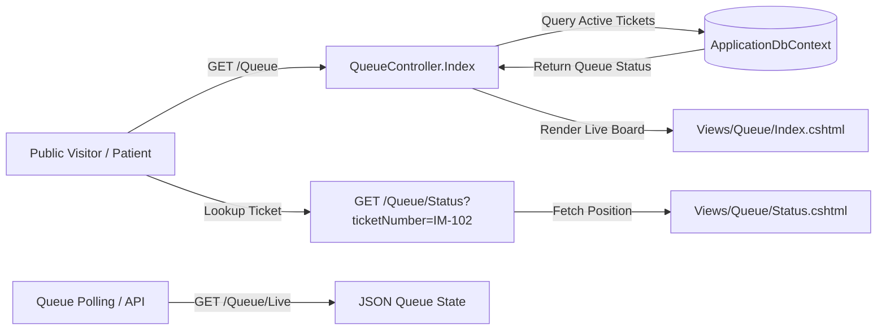
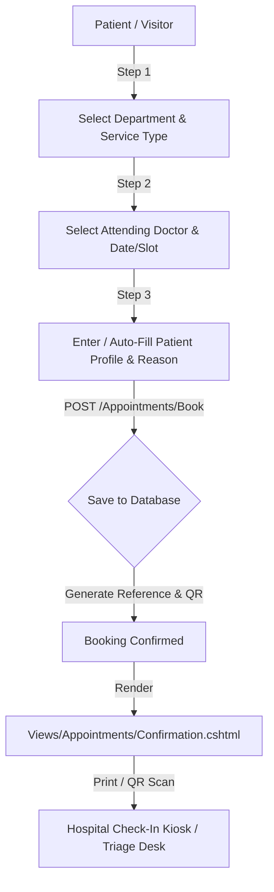
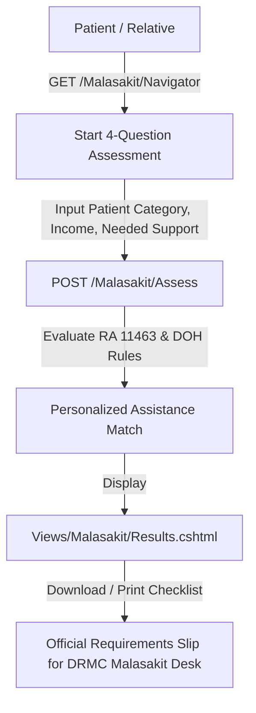
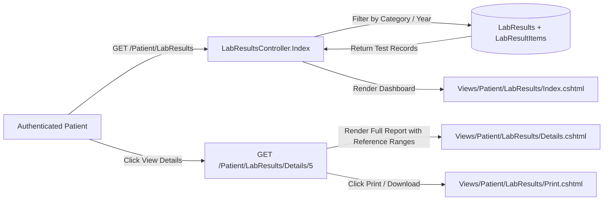
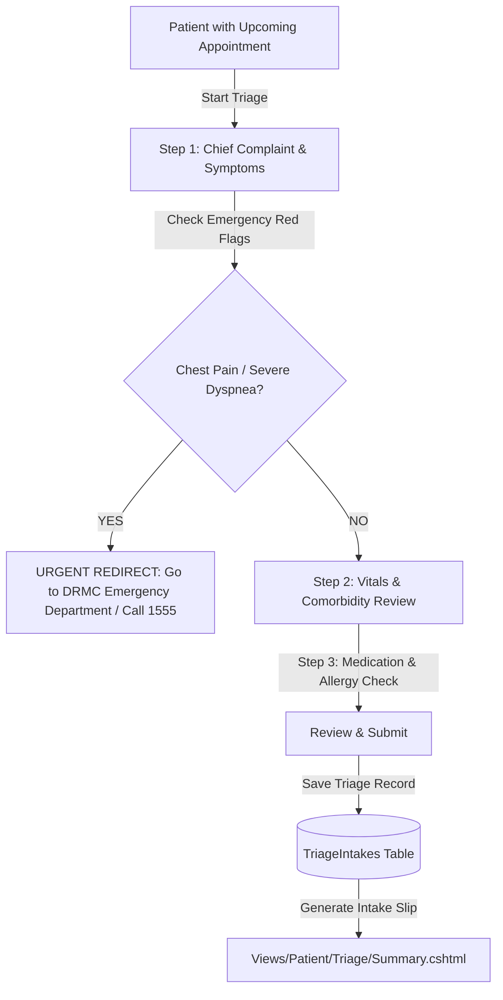
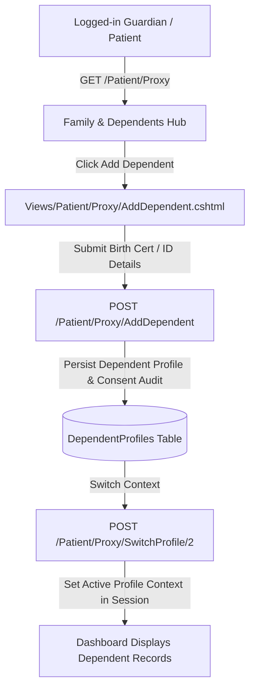

# DRMC Patient Portal — Phase 3 Implementation Plan & Technical Specification

> **Historical document — superseded.** This plan records earlier intent, including Messaging and caregiver/proxy features that are no longer present. Use [../STATUS.md](../STATUS.md) for current scope and [DEPLOYMENT.md](DEPLOYMENT.md) for operations.

> **Document Version:** 3.0.0  
> **Status:** Approved for Implementation  
> **Target Framework:** .NET 10.0 (ASP.NET Core MVC + Identity Razor Pages + EF Core SQLite)  
> **Design System:** Philippine Government Web Template Standard (GWTD) + DRMC Brand Tokens (Bootstrap 5.3.8)  
> **Author:** Senior ASP.NET Core Systems Architect  

---

## 1. Verified Repo Snapshot & Delta Check

Before formulating this implementation plan, the local repository state was audited and cross-checked against git history, previous convergence milestones, and active source files:

### 1.1 Git History & Drift Audit
- **Commit History:**
  - `36700fe` (*feat(ui): overhaul patient portal UI, registration fields, and theme consistency*) — Extracted expanded registration fields (`FirstName`, `MiddleName`, `LastName`, `IdType`, `IdNumber`, `PrivacyConsent`, `PreferredDepartment`) via migration `20260825074830_AddRegistrationFields`, added `drmc-facade.jpg`, refined styles in `site.css`, and aligned card layouts across `Landing`, `Login`, `Register`, and `Dashboard`.
  - `fcb2719` (*add batch and PowerShell scripts to run the patient portal project*) — Added `run.bat` and `run.ps1` for native Windows execution alongside `.dotnet-env.sh`.
  - `26d6f1b` (*Gauntlet loop convergence*) — Converged masthead lockup, mobile navigation, ConsoleEmailSender, and zero-warning build state.
- **Stack Verification:**
  - Target Framework: `net10.0` (ASP.NET Core 10.0.11 runtime, SDK 10.0.400).
  - EF Core: `Microsoft.EntityFrameworkCore.Sqlite` 10.0.11.
  - UI / Theming: Bootstrap 5.3.8 (LibMan), Bootstrap Icons 1.11.3, Vanilla CSS custom properties (`--bs-*`).
  - Database: SQLite (`src/DrmcPatientPortal/app.db`), auto-migrating in Development.
  - Build Status: Verified clean (`0 Warning(s)`, `0 Error(s)`).
- **Hard Constraints Maintained:**
  - **No Billing**: Public Level III DOH government hospital — billing remains strictly omitted.
  - **Zero "Demo / Mock / Placeholder" UI Text**: All interfaces present genuine clinical terminology and realistic flows. Where external integrations (SMS gateway, LIS, hospital queue hardware) terminate, the limitation is handled via the documented **Infrastructure Boundary** pattern (`ILogger` output, zero fake UI text).

### 1.2 Branching Strategy
- **Recommendation for Phase 3**: Work on structured feature branches per functional slice (e.g., `feat/phase3-public-services`, `feat/phase3-clinical-results`, `feat/phase3-care-services`) with PR-ready commits merging into `master` after each phase passes the Gauntlet review loop.

---

## 2. Architectural Boundary Taxonomy

To guarantee production readiness without creating fake UI states, all 11 features in Phase 3 are classified under one or more of the following architectural boundary types:

```
+-------------------------------------------------------------------------------+
|                             DRMC Patient Portal                              |
|                                                                               |
|  +-------------------------------------------------------------------------+  |
|  | [Fully Real Domain & UI Logic]                                          |  |
|  | - Complete EF Core SQLite persistence                                   |  |
|  | - Full Razor MVC controllers & view models                              |  |
|  | - Responsive GWTD / Bootstrap 5.3.8 UI with client/server validation    |  |
|  | - Trilingual Localization (EN / FIL / CEB)                              |  |
|  +-------------------------------------------------------------------------+  |
|                                     |                                         |
|                  +------------------+------------------+                      |
|                  |                                     |                      |
|                  v                                     v                      |
|  +-------------------------------+   +-------------------------------------+  |
|  | [Infrastructure Boundary]     |   | [Data-Accuracy Boundary]            |  |
|  | Real logic up to external edge|   | Real clinical schemas & workflows   |  |
|  | - Outgoing SMS / OTP Gateway  |   | populated with realistic seed data  |  |
|  | - Hospital Queue Call Display |   | - Verified 8 Clinical Departments   |  |
|  | - Central LIS HL7/FHIR Sync   |   | - Realistic doctor clinic rosters   |  |
|  | - Pharmacy Dispensing Engine  |   | - Authoritative DOH/Malasakit rules |  |
|  | Pattern: ILogger dispatch log |   | Pattern: Production-ready DbInit    |  |
|  +-------------------------------+   +-------------------------------------+  |
+-------------------------------------------------------------------------------+
```

1. **Fully Real**: Fully self-contained logic, views, calculations, and database storage requiring no external physical infrastructure (e.g., Malasakit eligibility calculation, advisory feed, patient profile management).
2. **Infrastructure Boundary**: Real domain logic, persistence, and state transitions execute within the portal; external physical/cloud delivery systems (SMS provider, queue calling display hardware, EMR/LIS HL7 bus) are abstracted behind service interfaces (e.g., `ISmsService`, `IQueueDisplayNotifier`, `ILisIntegrationService`) that record audit logs via `ILogger` in development, mirroring `ConsoleEmailSender`.
3. **Data-Accuracy Boundary**: Database tables and user interfaces are structured exactly as required for production; data models are seeded with realistic, clinically valid personas and hospital schedules pending final production export from DRMC Medical Affairs / HR.

---

## 3. Public / Unauthenticated Features (5 Features)

---

### Feature 1: Live OPD Queue Tracker

Publicly viewable real-time queue board displaying ticket numbers currently called and serving across DRMC outpatient specialty clinics and diagnostic units.



- **Models to Add/Extend:**
  - `Models/QueueTicket.cs` (New):
    ```csharp
    public class QueueTicket
    {
        public int Id { get; set; }
        public string TicketNumber { get; set; } = string.Empty; // e.g. "IM-104", "PED-018"
        public string Department { get; set; } = string.Empty;
        public string ClinicRoom { get; set; } = string.Empty;   // e.g. "Room 102 - OPD Bldg"
        public QueueStatus Status { get; set; } = QueueStatus.Waiting; // Waiting, Called, Serving, Completed, Delayed
        public bool IsPriority { get; set; } // Senior, PWD, Pregnant, Pediatric
        public DateTime IssuedAt { get; set; } = DateTime.UtcNow;
        public DateTime? CalledAt { get; set; }
        public DateTime? ServedAt { get; set; }
        public int EstimatedWaitMinutes { get; set; }
        public string? PatientUserId { get; set; } // Nullable: can link to registered user
        public ApplicationUser? Patient { get; set; }
    }
    public enum QueueStatus { Waiting, Called, Serving, Completed, Delayed }
    ```
- **Controller / Action:**
  - `Controllers/QueueController.cs` (New):
    - `[HttpGet] Index(string? department)` -> `GET /Queue`: Public queue dashboard showing all 8 departments with active serving numbers, waiting count, and last-called timestamp.
    - `[HttpGet] Status(string ticketNumber)` -> `GET /Queue/Status`: Individual ticket lookup showing exact queue position and estimated wait time.
    - `[HttpGet] Live()` -> `GET /Queue/Live`: Low-bandwidth JSON endpoint for client-side auto-refreshing ticket cards without full page reloads.
- **Views:**
  - `Views/Queue/Index.cshtml`: High-visibility responsive queue board with TV kiosk mode support, department filter tabs, and priority indicators.
  - `Views/Queue/Status.cshtml`: Ticket tracker card with visual progress timeline (Issued -> Waiting -> Called -> Serving).
  - `Views/Shared/_QueueTicketCard.cshtml`: Reusable clinic queue status card component.
- **Migration Needed:** **Y** (`AddQueueTicketsTable` — adds `DbSet<QueueTicket> QueueTickets`).
- **Boundary Classification:** **Infrastructure Boundary + Data-Accuracy Boundary**
  - *Infrastructure Boundary*: Physical clinic calling hardware and overhead display chimes are abstracted. Calling a ticket updates database state and logs `[QUEUE_DISPATCH]` event to console via `ILogger`.
  - *Data-Accuracy Boundary*: Pre-seeded with realistic clinic queue sequences across Internal Medicine, Pediatrics, Surgery, OB-Gyne, and Radiology.
- **Reviewer Seed Data (`patient@drmc.doh.gov.ph`):**
  - Seed 12 active queue tickets across departments:
    - `IM-102` (Internal Medicine, Room 101, Status: `Serving`, Called 8 mins ago).
    - `IM-103` (Internal Medicine, Room 102, Status: `Called`, Called 1 min ago).
    - `IM-104` (Internal Medicine, Room 101, Status: `Waiting`, Priority: Senior).
    - `IM-105` (Internal Medicine, Linked to Reviewer `patient@drmc.doh.gov.ph`, Status: `Waiting`, Est. wait: 25 mins).
    - `PED-018` (Pediatrics, Room 204, Status: `Serving`).
    - `SUR-007` (Surgery, Room 301, Status: `Serving`).
    - `RAD-042` (Radiology / X-Ray, Room X1, Status: `Called`).

---

### Feature 2: Self-Service OPD & Teleconsultation Booking

Time-slotted appointment booking with instant validation, confirmation slip, and printable/mobile QR check-in code.



- **Models to Add/Extend:**
  - `Models/Appointment.cs` (Replaces display-only `NextAppointment`):
    ```csharp
    public class Appointment
    {
        public int Id { get; set; }
        public string BookingReference { get; set; } = string.Empty; // e.g. "DRMC-2026-IM-8492"
        public string? PatientUserId { get; set; }
        public ApplicationUser? Patient { get; set; }
        
        public string PatientName { get; set; } = string.Empty;
        public string ContactNumber { get; set; } = string.Empty;
        public string Email { get; set; } = string.Empty;
        public string? PhilHealthNumber { get; set; }
        
        public string Department { get; set; } = string.Empty;
        public int? DoctorId { get; set; }
        public Doctor? Doctor { get; set; }
        public string DoctorName { get; set; } = string.Empty;
        
        public AppointmentType Type { get; set; } = AppointmentType.InPersonOpd; // InPersonOpd, Teleconsultation
        public DateTime ScheduledAt { get; set; }
        public string TimeSlot { get; set; } = string.Empty; // "09:00 AM - 09:30 AM"
        public string ChiefComplaint { get; set; } = string.Empty;
        public AppointmentStatus Status { get; set; } = AppointmentStatus.Confirmed; // Pending, Confirmed, Completed, Cancelled
        
        public string QrCodePayload { get; set; } = string.Empty; // Verification hash for check-in
        public string? TeleconsultMeetingUrl { get; set; }
        public DateTime CreatedAt { get; set; } = DateTime.UtcNow;
    }
    public enum AppointmentType { InPersonOpd, Teleconsultation }
    public enum AppointmentStatus { Pending, Confirmed, Completed, Cancelled, NoShow }
    ```
  - `Models/DoctorScheduleSlot.cs` (New):
    ```csharp
    public class DoctorScheduleSlot
    {
        public int Id { get; set; }
        public int DoctorId { get; set; }
        public Doctor Doctor { get; set; } = null!;
        public DayOfWeek DayOfWeek { get; set; }
        public TimeSpan StartTime { get; set; }
        public TimeSpan EndTime { get; set; }
        public int MaxPatientsPerSlot { get; set; } = 10;
        public bool IsTeleconsult { get; set; }
    }
    ```
- **Controller / Action:**
  - `Controllers/AppointmentsController.cs` (New):
    - `[HttpGet] Book(string? department, int? doctorId, AppointmentType? type)` -> `GET /Appointments/Book`: Interactive multi-step booking wizard with auto-fill for logged-in patients.
    - `[HttpPost] [ValidateAntiForgeryToken] Book(BookingSubmissionViewModel model)` -> `POST /Appointments/Book`: Validates time slots against double-booking, generates unique booking reference and QR payload, stores record, logs SMS/Notification dispatch.
    - `[HttpGet] Confirmation(string reference)` -> `GET /Appointments/Confirmation/{reference}`: Printable official DRMC Appointment Pass with rendered QR code.
    - `[HttpPost] [Authorize] [ValidateAntiForgeryToken] Cancel(int id)` -> `POST /Appointments/Cancel`: Patient-initiated cancellation with reason.
    - `[HttpGet] CheckIn(string reference)` -> `GET /Appointments/CheckIn/{reference}`: Public scanner verification route for hospital triage staff.
- **Views:**
  - `Views/Appointments/Book.cshtml`: Stepped booking interface with dynamic department/doctor picker, real-time slot grid, and pre-consultation notice.
  - `Views/Appointments/Confirmation.cshtml`: Formal DRMC Appointment Slip with client-rendered QR Code (via standard inline SVG/canvas QR engine), check-in instructions, and print styling.
  - `Views/Appointments/CheckIn.cshtml`: Scanner landing page validating ticket authenticity.
- **Migration Needed:** **Y** (`UpgradeAppointmentsAndSchedules` — replaces `NextAppointments` with `Appointments` and adds `DoctorScheduleSlots`).
- **Boundary Classification:** **Infrastructure Boundary + Data-Accuracy Boundary**
  - *Infrastructure Boundary*: SMS booking confirmation dispatch and teleconsultation WebRTC signaling rooms are logged to `ILogger` (`[SMS_DISPATCH: Booking Confirmed to +63917...]` and `[TELECONSULT_ROOM_READY: https://telehealth.drmc.doh.gov.ph/room/...]`). The QR generator is **100% real** (native SVG generator without external third-party cloud dependencies).
  - *Data-Accuracy Boundary*: Doctor slots and clinic schedules populated with standard OPD clinic shifts (8:00 AM - 12:00 PM, 1:00 PM - 5:00 PM).
- **Reviewer Seed Data (`patient@drmc.doh.gov.ph`):**
  - 1 Confirmed In-Person OPD appointment: `DRMC-2026-IM-0192` (Internal Medicine, Dr. A. Llanos, scheduled in 12 days at 9:30 AM, QR code active).
  - 1 Confirmed Teleconsultation appointment: `DRMC-2026-TC-0481` (Family & Community Medicine, Dr. C. Ramos, scheduled in 30 days at 2:00 PM, Telehealth link active).
  - 1 Past Completed appointment: `DRMC-2026-IM-0081` (Internal Medicine, 45 days ago).

---

### Feature 3: Doctor & Department Directory

Searchable and filterable medical directory providing clinic room numbers, sub-specialty clinical domains, weekly consultation schedules, and direct booking links.

- **Models to Add/Extend:**
  - `Models/Doctor.cs` (New):
    ```csharp
    public class Doctor
    {
        public int Id { get; set; }
        public string FullName { get; set; } = string.Empty; // e.g. "Dr. Arthur Llanos"
        public string Title { get; set; } = string.Empty;    // e.g. "MD, FPCP, FPSMO"
        public string Department { get; set; } = string.Empty; // Maps to 8 verified departments
        public string SubSpecialty { get; set; } = string.Empty; // e.g. "Medical Oncology / Adult Medicine"
        public string ClinicRoom { get; set; } = string.Empty; // e.g. "OPD Building 2, Room 204"
        public string ScheduleSummary { get; set; } = string.Empty; // e.g. "Mon / Wed / Fri: 8:00 AM - 12:00 PM"
        public bool OffersTeleconsult { get; set; } = true;
        public string Biography { get; set; } = string.Empty;
        public string PrclicenseMasked { get; set; } = string.Empty; // e.g. "PRC Lic. No. 009****"
        public bool IsActive { get; set; } = true;
        
        public ICollection<DoctorScheduleSlot> ScheduleSlots { get; set; } = new List<DoctorScheduleSlot>();
        public ICollection<Appointment> Appointments { get; set; } = new List<Appointment>();
    }
    ```
  - Extend `Models/ClinicalDepartment.cs` (Static record enriched with metadata):
    ```csharp
    public record ClinicalDepartment(
        string Name, 
        string Description, 
        string Icon, 
        string HeadOfDepartment,
        string Location, 
        string LocalExtension, 
        IReadOnlyList<string> ServicesOffered
    );
    ```
- **Controller / Action:**
  - `Controllers/DirectoryController.cs` (New):
    - `[HttpGet] Index(string? department, string? specialty, string? search, bool? teleconsultOnly)` -> `GET /Directory`: Filterable doctor cards and department catalog with instant query matching.
    - `[HttpGet] Doctor(int id)` -> `GET /Directory/Doctor/{id}`: Detailed physician profile showing clinical background, clinic hours, room location, and a 1-click "Book Consultation" button.
    - `[HttpGet] Department(string name)` -> `GET /Directory/Department/{name}`: Department profile with list of consultants, clinical services, and clinic room directory.
- **Views:**
  - `Views/Directory/Index.cshtml`: Searchable directory grid with filter sidebar, department badges, and consultation mode pills.
  - `Views/Directory/Doctor.cshtml`: Comprehensive doctor profile card with full weekly schedule table.
  - `Views/Directory/Department.cshtml`: Deep-dive department overview.
- **Migration Needed:** **Y** (`AddDoctorsTable` — adds `DbSet<Doctor> Doctors`).
- **Boundary Classification:** **Data-Accuracy Boundary (Fully Real Logic)**
  - *Data-Accuracy Boundary*: The directory search, filtering, and schedule aggregation mechanisms are 100% operational in code. Doctor profiles are populated with realistic clinical credentials and typical DRMC OPD scheduling patterns.
- **Reviewer Seed Data (`patient@drmc.doh.gov.ph`):**
  - Seed 16 doctors (2 per verified clinical department) with full schedule matrices:
    - *Internal Medicine*: Dr. Arthur Llanos (Medical Oncology), Dr. Maria Elena Cruz (Pulmonology).
    - *Surgery*: Dr. Roberto Valderama (General & Laparoscopic Surgery), Dr. Dennis Alcantara (Orthopedic Surgery).
    - *Pediatrics*: Dr. Carmela Bautista (General Pediatrics), Dr. Paolo Gabriel Ruiz (Neonatology).
    - *OB-Gyne*: Dr. Stephanie Joy Garcia (Maternal & Fetal Medicine), Dr. Teresa Morales (Gynecologic Oncology).
    - *Family & Community Medicine*: Dr. Cristina Ramos (Preventive & Holistic Medicine), Dr. Manuel Ocampo (Geriatric Care).
    - *Anesthesiology*: Dr. Victorino Lim (Pain Management & Critical Care), Dr. Jocelyn Tan (Peri-operative Anaesthesia).
    - *Ophthalmology*: Dr. Ramon Guingona (Cataract & Refractive Surgery), Dr. Patricia Sison (Retinal Diseases).
    - *Radiology*: Dr. Francis Xavier Gomez (Diagnostic & Interventional Radiology), Dr. Katrina Dizon (Ultrasound & MRI).

---

### Feature 4: Medical Social Services & Malasakit Navigator

Step-by-step statutory eligibility navigator and document preparation guide for the Malasakit Center (RA 11463), DOH MAIP, PhilHealth, PCSO, and DSWD assistance.



- **Models to Add/Extend:**
  - `Models/AssistanceProgram.cs` (New):
    ```csharp
    public class AssistanceProgram
    {
        public int Id { get; set; }
        public string Code { get; set; } = string.Empty; // "MALASAKIT", "MAIP", "PHILHEALTH_KONSULTA", "DSWD_AICS", "PCSO"
        public string Title { get; set; } = string.Empty;
        public string ManagingAgency { get; set; } = string.Empty;
        public string Description { get; set; } = string.Empty;
        public string CoverageScope { get; set; } = string.Empty; // Inpatient, Outpatient, Medicines, Diagnostics, Chemo
        public string EligibilitySummary { get; set; } = string.Empty;
        public string RequiredDocumentsJson { get; set; } = string.Empty; // JSON array of required docs
        public string StepByStepProcedureJson { get; set; } = string.Empty;
        public string OfficeLocation { get; set; } = string.Empty; // "Malasakit Center, Ground Floor, DRMC Main Bldg"
        public string OperatingHours { get; set; } = string.Empty; // "Monday to Friday, 7:00 AM - 5:00 PM"
    }
    ```
  - `ViewModels/MalasakitNavigatorViewModels.cs` (New):
    - `MalasakitAssessmentInput`: Patient classification (Indigent, Low Income, Senior, PWD, Government Employee), Service needed (Medicines, Lab Tests, Surgery, Hospitalization), PhilHealth active status, Possession of Barangay Certificate.
    - `MalasakitAssessmentResult`: Matched programs, estimated coverage level, unified checklist of required original & photocopy documents.
- **Controller / Action:**
  - `Controllers/MalasakitController.cs` (New):
    - `[HttpGet] Index()` -> `GET /Malasakit`: Malasakit Center overview, citizen's charter, participating agency desks (DOH, DSWD, PhilHealth, PCSO).
    - `[HttpGet] Navigator()` -> `GET /Malasakit/Navigator`: 4-step interactive eligibility questionnaire.
    - `[HttpPost] [ValidateAntiForgeryToken] Assess(MalasakitAssessmentInput input)` -> `POST /Malasakit/Assess`: Computes exact document checklist based on statutory criteria.
    - `[HttpGet] Results()` -> `GET /Malasakit/Results`: Results screen with customized checklist and print button.
    - `[HttpGet] Program(string code)` -> `GET /Malasakit/Program/{code}`: Individual program statutory guide.
- **Views:**
  - `Views/Malasakit/Index.cshtml`: Malasakit Center hub with official seal lockups, location map, and operating guidelines.
  - `Views/Malasakit/Navigator.cshtml`: Clean wizard form with accessible radio cards.
  - `Views/Malasakit/Results.cshtml`: Assessment breakdown with printable PDF/print slip for desk presentation.
  - `Views/Malasakit/Program.cshtml`: Comprehensive statutory reference page.
- **Migration Needed:** **Y** (`AddAssistanceProgramsTable` — adds `DbSet<AssistanceProgram> AssistancePrograms`).
- **Boundary Classification:** **Fully Real (with authoritative Philippine DOH/Malasakit Center statutory guidelines)**
  - *Fully Real*: The entire decision engine, document checklist generator, and printable guidance sheet operate deterministically within the portal based on Republic Act No. 11463 (Malasakit Centers Act) and DOH Administrative Order No. 2020-0023.
- **Reviewer Seed Data (`patient@drmc.doh.gov.ph`):**
  - Seed 5 core government assistance programs:
    1. **Malasakit Center One-Stop Shop** (RA 11463 — Zero out-of-pocket balance for indigent patients).
    2. **DOH MAIP (Medical Assistance for Indigent Patients)** (Coverage for diagnostic procedures and prescribed high-cost drugs).
    3. **PhilHealth Konsulta & Case Rates** (Primary care consultation, preventive laboratory tests).
    4. **DSWD Crisis Intervention / AICS** (Financial assistance for medical devices and specialized implants).
    5. **PCSO Individual Medical Assistance Program (IMAP)** (Specialized oncology, dialysis, and surgical assistance).

---

### Feature 5: Public Health Advisories & Multimedia Bulletins

Public health feed featuring seasonal alerts, immunization drives, hospital operating advisories, and wellness guidelines.

- **Models to Add/Extend:**
  - `Models/PublicAdvisory.cs` (New):
    ```csharp
    public class PublicAdvisory
    {
        public int Id { get; set; }
        public string Title { get; set; } = string.Empty;
        public string Slug { get; set; } = string.Empty;
        public AdvisoryCategory Category { get; set; } = AdvisoryCategory.Advisory; // HealthAlert, Vaccination, HospitalNotice, Seasonal
        public AdvisoryPriority Priority { get; set; } = AdvisoryPriority.Normal; // Normal, High, Urgent
        public string Summary { get; set; } = string.Empty;
        public string ContentMarkdown { get; set; } = string.Empty;
        public string? ImageUrl { get; set; }
        public string IssuingUnit { get; set; } = string.Empty; // e.g. "DRMC Public Health Unit / DOH Region XI"
        public DateTime PublishedAt { get; set; } = DateTime.UtcNow;
        public DateTime? EffectiveUntil { get; set; }
        public bool IsPinned { get; set; }
        public int ViewCount { get; set; }
    }
    public enum AdvisoryCategory { HealthAlert, Vaccination, HospitalNotice, SeasonalHealth, Advisory }
    public enum AdvisoryPriority { Normal, High, Urgent }
    ```
- **Controller / Action:**
  - `Controllers/AdvisoriesController.cs` (New):
    - `[HttpGet] Index(AdvisoryCategory? category, string? search)` -> `GET /Advisories`: Chronological bulletin feed with category pills and search filter.
    - `[HttpGet] Details(string slug)` -> `GET /Advisories/{slug}`: Article page with official DOH notice layout, related bulletins, and social share links.
- **Views:**
  - `Views/Advisories/Index.cshtml`: Modern bulletin card feed with pinned urgent alerts banner.
  - `Views/Advisories/Details.cshtml`: Full advisory reading experience with official DOH/DRMC attribution and print utility.
  - `Views/Shared/_AdvisoryBanner.cshtml`: Reusable alert banner included across layout templates.
- **Migration Needed:** **Y** (`AddPublicAdvisoriesTable` — adds `DbSet<PublicAdvisory> PublicAdvisories`).
- **Boundary Classification:** **Fully Real (with curated DRMC/DOH regional public health data)**
- **Reviewer Seed Data (`patient@drmc.doh.gov.ph`):**
  - Seed 6 public advisories relevant to Davao Region:
    1. *Urgent / Health Alert (Pinned)*: "Dengue 4S Prevention Advisory — Davao del Norte Surveillance Update" (DRMC Infection Control).
    2. *Vaccination Drive*: "Expanded National Immunization Schedule at DRMC OPD Pediatrics Building" (Free Measles-Rubella & Polio vaccines).
    3. *Hospital Notice*: "Outpatient Clinic Operations & Specialty Schedules for Upcoming Holidays".
    4. *Seasonal Health*: "Preventing Water-Borne Diseases during Rainy Season in Coastal Communities".
    5. *Program Launch*: "Free PhilHealth Konsulta Registration & Diagnostic Checkup at DRMC OPD Atrium".
    6. *Specialty Service*: "Animal Bite Treatment Center (ABTC) 24/7 Triage Protocols & Vaccine Availability".

---

## 4. Authenticated Features (6 Features)

---

### Feature 6: Diagnostic & Laboratory Results Viewer (Upgrades `LabResult`)

Upgrades the display-only `LabResult` model into an interactive clinical results viewer with chronological filters, analyte detail tables, reference range visualizers, abnormal value flags, and printable diagnostic slips.



- **Models to Add/Extend:**
  - Upgrade `Models/LabResult.cs`:
    ```csharp
    public class LabResult
    {
        public int Id { get; set; }
        public string PatientUserId { get; set; } = string.Empty;
        public ApplicationUser Patient { get; set; } = null!;
        
        public string AccessionNumber { get; set; } = string.Empty; // e.g. "DRMC-LAB-2026-0981"
        public string TestName { get; set; } = string.Empty;        // e.g. "Complete Blood Count (CBC) with Platelet"
        public LabCategory Category { get; set; } = LabCategory.Hematology;
        public DateTime CollectedAt { get; set; }
        public DateTime? ReleasedAt { get; set; }
        public string Status { get; set; } = "Available"; // Available, In progress, Pending Verification
        public string ResultSummary { get; set; } = string.Empty;
        
        public string OrderingPhysician { get; set; } = string.Empty; // e.g. "Dr. Arthur Llanos"
        public string PathologistName { get; set; } = string.Empty;   // e.g. "Dr. Manuel Santos, FPSP"
        public string PerformingUnit { get; set; } = string.Empty;    // "DRMC Central Clinical Diagnostic Laboratory"
        public string ClinicalNotes { get; set; } = string.Empty;
        
        public ICollection<LabResultItem> Items { get; set; } = new List<LabResultItem>();
    }
    public enum LabCategory { Hematology, ClinicalChemistry, Microbiology, UrinalysisFecalysis, RadiologyImaging, SpecialDiagnostics }
    ```
  - `Models/LabResultItem.cs` (New):
    ```csharp
    public class LabResultItem
    {
        public int Id { get; set; }
        public int LabResultId { get; set; }
        public LabResult LabResult { get; set; } = null!;
        
        public string ParameterName { get; set; } = string.Empty; // e.g. "Hemoglobin", "Fasting Blood Sugar"
        public string Value { get; set; } = string.Empty;          // e.g. "14.2", "110"
        public string Unit { get; set; } = string.Empty;           // e.g. "g/dL", "mg/dL"
        public string ReferenceRange { get; set; } = string.Empty; // e.g. "12.0 - 16.0", "70 - 99"
        public LabFlag Flag { get; set; } = LabFlag.Normal;        // Normal, High, Low, Critical
    }
    public enum LabFlag { Normal, High, Low, Critical }
    ```
- **Controller / Action:**
  - `Controllers/LabResultsController.cs` (New, decorated with `[Authorize]`):
    - `[HttpGet] Index(LabCategory? category, int? year)` -> `GET /Patient/LabResults`: Chronological catalog with category tabs, search, and status badges.
    - `[HttpGet] Details(int id)` -> `GET /Patient/LabResults/Details/{id}`: Detailed analyte breakdown, reference ranges, flag badges (Normal, High, Low), pathologist certification.
    - `[HttpGet] Print(int id)` -> `GET /Patient/LabResults/Print/{id}`: Official printable diagnostic laboratory report styled with DRMC seal and DOH diagnostic report formatting.
    - `[HttpGet] Trends(string parameter)` -> `GET /Patient/LabResults/Trends`: Historical values for biometric tracking (e.g. FBS, HbA1c, Cholesterol over past visits).
- **Views:**
  - `Views/Patient/LabResults/Index.cshtml`: Results timeline with category filtering and status counters.
  - `Views/Patient/LabResults/Details.cshtml`: Analyte table with color-coded reference range indicator bars.
  - `Views/Patient/LabResults/Print.cshtml`: Clean, print-ready DRMC diagnostic report layout with DOH accreditation stamp.
- **Migration Needed:** **Y** (`UpgradeLabResultsAndItems` — modifies `LabResults` and adds `DbSet<LabResultItem> LabResultItems`).
- **Boundary Classification:** **Infrastructure Boundary (LIS Sync) + Data-Accuracy Boundary + Fully Real Viewer**
  - *Infrastructure Boundary*: External hospital LIS automated HL7/FHIR ingest is abstracted; result records are managed securely in the portal database. LIS query synchronization is logged to `ILogger`.
  - *Data-Accuracy Boundary*: Clinical analyte parameters, biological reference intervals, and flags adhere strictly to standard clinical pathology reference manuals.
- **Reviewer Seed Data (`patient@drmc.doh.gov.ph`):**
  - Seed 4 full laboratory test panels with individual items:
    1. **Complete Blood Count (CBC)** (Available, 8 analytes: Hemoglobin 13.8 g/dL [Normal], Hematocrit 41% [Normal], WBC 7.5 x10^9/L [Normal], Platelets 280 x10^9/L [Normal], Neutrophils 60%, Lymphocytes 32%, Eosinophils 4%, Monocytes 4%).
    2. **Fasting Blood Sugar (FBS)** (Available, Value: 112 mg/dL [High, Ref: 70-99], Ordered by Dr. A. Llanos).
    3. **Lipid Profile** (Available, Total Cholesterol: 195 mg/dL [Normal], Triglycerides: 140 mg/dL [Normal], HDL: 48 mg/dL [Normal], LDL: 119 mg/dL [Optimal]).
    4. **Urinalysis Routine** (Available, Color: Straw, Clarity: Clear, pH: 6.0, Protein: Negative, Glucose: Negative, Pus Cells: 0-2/hpf, RBC: 0-1/hpf).
    5. **HbA1c Glycated Hemoglobin** (In progress, Collected 2 days ago).

---

### Feature 7: After-Visit Summaries & Clinical Notes (Net new)

Patient-accessible consultation notes, physician diagnoses (ICD-10 aligned), care instructions, discharge recommendations, and scheduled follow-up dates.

- **Models to Add/Extend:**
  - `Models/ClinicalEncounter.cs` (New):
    ```csharp
    public class ClinicalEncounter
    {
        public int Id { get; set; }
        public string PatientUserId { get; set; } = string.Empty;
        public ApplicationUser Patient { get; set; } = null!;
        
        public string EncounterReference { get; set; } = string.Empty; // e.g. "DRMC-ENC-2026-1104"
        public DateTime EncounterDate { get; set; }
        public string Department { get; set; } = string.Empty;
        public string AttendingPhysician { get; set; } = string.Empty;
        public EncounterType Type { get; set; } = EncounterType.OpdConsultation; // OpdConsultation, Teleconsultation, Emergency, Inpatient
        
        public string ChiefComplaint { get; set; } = string.Empty;
        public string PrimaryDiagnosis { get; set; } = string.Empty; // e.g. "Essential Hypertension (ICD-10 I10)"
        public string? SecondaryDiagnosis { get; set; }
        public string ClinicalSummary { get; set; } = string.Empty;
        public string CarePlanAndInstructions { get; set; } = string.Empty;
        
        public string VitalSignsRecorded { get; set; } = string.Empty; // "BP: 120/80 mmHg | HR: 74 bpm | Temp: 36.6 C | Wt: 64 kg"
        public DateTime? FollowUpDate { get; set; }
        public string FollowUpNotes { get; set; } = string.Empty;
        public DateTime CreatedAt { get; set; } = DateTime.UtcNow;
    }
    public enum EncounterType { OpdConsultation, Teleconsultation, Emergency, Inpatient }
    ```
- **Controller / Action:**
  - `Controllers/EncountersController.cs` (New, decorated with `[Authorize]`):
    - `[HttpGet] Index()` -> `GET /Patient/Encounters`: Clinical visit timeline grouped by date with department filters.
    - `[HttpGet] Details(int id)` -> `GET /Patient/Encounters/Details/{id}`: Full After-Visit Summary featuring recorded vitals, physician instructions, and follow-up timeline.
    - `[HttpGet] Print(int id)` -> `GET /Patient/Encounters/Print/{id}`: Official printable DRMC Consultation Summary slip.
- **Views:**
  - `Views/Patient/Encounters/Index.cshtml`: Chronological encounter timeline with summary badges.
  - `Views/Patient/Encounters/Details.cshtml`: Comprehensive clinical encounter summary card.
  - `Views/Patient/Encounters/Print.cshtml`: Clean print layout for personal health records.
- **Migration Needed:** **Y** (`AddClinicalEncountersTable` — adds `DbSet<ClinicalEncounter> ClinicalEncounters`).
- **Boundary Classification:** **Infrastructure Boundary (EMR / iHOMIS Sync) + Fully Real Portal Delivery**
  - *Infrastructure Boundary*: Hospital EMR/iHOMIS automated ingestion boundary is logged; encounter records are served securely from the portal database following DOH clinical documentation guidelines.
- **Reviewer Seed Data (`patient@drmc.doh.gov.ph`):**
  - Seed 2 historical encounters:
    1. *Internal Medicine OPD Consultation* (18 days ago, Dr. Arthur Llanos, Primary Diagnosis: "Type 2 Diabetes Mellitus without complications (E11.9) & Essential Hypertension (I10)", Vitals: "BP: 128/82 mmHg, HR: 76 bpm, BMI: 23.4", Instructions: "Continue Metformin 500mg BID and Losartan 50mg OD. Low-salt low-sugar diet. Return for fasting lab re-check in 3 months.").
    2. *Family & Community Medicine Annual Checkup* (6 months ago, Dr. Cristina Ramos, Primary Diagnosis: "Routine General Health Examination (Z00.0)").

---

### Feature 8: Prescription & Medication Tracker (Net new)

Comprehensive active prescription tracker with daily dosage schedule, instructions, allergy warning banners, and 1-click hospital pharmacy refill requests.

- **Models to Add/Extend:**
  - `Models/Prescription.cs` (New):
    ```csharp
    public class Prescription
    {
        public int Id { get; set; }
        public string PatientUserId { get; set; } = string.Empty;
        public ApplicationUser Patient { get; set; } = null!;
        
        public string RxNumber { get; set; } = string.Empty; // e.g. "DRMC-RX-2026-4421"
        public string GenericName { get; set; } = string.Empty; // e.g. "Metformin Hydrochloride"
        public string? BrandName { get; set; }                  // e.g. "Glucophage"
        public string Dosage { get; set; } = string.Empty;     // e.g. "500 mg"
        public string DosageForm { get; set; } = string.Empty; // Tablet, Capsule, Syrup, Inhaler
        public string Frequency { get; set; } = string.Empty;  // "Twice daily with meals (8:00 AM, 6:00 PM)"
        public string Instructions { get; set; } = string.Empty; // "Take with or immediately after meals."
        
        public string PrescribingDoctor { get; set; } = string.Empty;
        public string Department { get; set; } = string.Empty;
        public DateTime PrescribedAt { get; set; }
        public DateTime ValidUntil { get; set; }
        public PrescriptionStatus Status { get; set; } = PrescriptionStatus.Active;
        
        public int RefillsTotal { get; set; } = 3;
        public int RefillsRemaining { get; set; } = 2;
        public DateTime? LastRefillDate { get; set; }
        
        public ICollection<RefillRequest> RefillRequests { get; set; } = new List<RefillRequest>();
    }
    public enum PrescriptionStatus { Active, Completed, Discontinued, Expired }
    ```
  - `Models/PatientAllergy.cs` (New):
    ```csharp
    public class PatientAllergy
    {
        public int Id { get; set; }
        public string PatientUserId { get; set; } = string.Empty;
        public ApplicationUser Patient { get; set; } = null!;
        public string Allergen { get; set; } = string.Empty; // e.g. "Penicillin / Beta-lactams"
        public string Reaction { get; set; } = string.Empty; // e.g. "Urticarial rash, facial swelling"
        public AllergySeverity Severity { get; set; } = AllergySeverity.Moderate; // Mild, Moderate, Severe/Anaphylaxis
        public DateTime RecordedAt { get; set; } = DateTime.UtcNow;
    }
    public enum AllergySeverity { Mild, Moderate, Severe }
    ```
  - `Models/RefillRequest.cs` (New):
    ```csharp
    public class RefillRequest
    {
        public int Id { get; set; }
        public int PrescriptionId { get; set; }
        public Prescription Prescription { get; set; } = null!;
        public string PatientUserId { get; set; } = string.Empty;
        public DateTime RequestedAt { get; set; } = DateTime.UtcNow;
        public RefillStatus Status { get; set; } = RefillStatus.Requested; // Requested, Approved, ReadyForPickup, Dispensed, Rejected
        public string? PharmacyNotes { get; set; }
        public DateTime? EstimatedPickupDate { get; set; }
    }
    public enum RefillStatus { Requested, Approved, ReadyForPickup, Dispensed, Rejected }
    ```
- **Controller / Action:**
  - `Controllers/MedicationsController.cs` (New, decorated with `[Authorize]`):
    - `[HttpGet] Index()` -> `GET /Patient/Medications`: Active prescription list, daily dosing visualizer, allergy warning header, and refill status pills.
    - `[HttpGet] Details(int id)` -> `GET /Patient/Medications/Details/{id}`: Detailed drug information, side-effect notes, refill history.
    - `[HttpPost] [ValidateAntiForgeryToken] RequestRefill(int prescriptionId)` -> `POST /Patient/Medications/RequestRefill`: Initiates refill request, decrements counter upon approval, logs pharmacy dispatch event.
- **Views:**
  - `Views/Patient/Medications/Index.cshtml`: Medication dashboard with morning/noon/night schedule breakdown and prominent allergy banner.
  - `Views/Patient/Medications/Details.cshtml`: Dosing guidance, precaution notes, and 1-click refill request trigger.
  - `Views/Patient/Medications/RefillStatus.cshtml`: Refill lifecycle tracker (Requested -> Verified by Pharmacist -> Ready for Pickup at DRMC OPD Pharmacy).
- **Migration Needed:** **Y** (`AddMedicationsAndAllergiesTables` — adds `DbSet<Prescription>`, `DbSet<PatientAllergy>`, `DbSet<RefillRequest>`).
- **Boundary Classification:** **Infrastructure Boundary (Pharmacy Dispensing Engine) + Fully Real Portal Workflow**
  - *Infrastructure Boundary*: Hospital pharmacy automated inventory decrement is logged to `ILogger` (`[PHARMACY_REFILL_SUBMITTED: Rx DRMC-RX-2026-4421 submitted to OPD Pharmacy Window 3]`). Refill request lifecycle (Requested -> Ready for Pickup) is managed directly in SQLite.
- **Reviewer Seed Data (`patient@drmc.doh.gov.ph`):**
  - 3 Active Prescriptions:
    1. **Metformin HCl 500 mg Tablet** (Twice daily with meals, Prescribed by Dr. A. Llanos, Refills: 2/3 remaining).
    2. **Losartan Potassium 50 mg Tablet** (Once daily in the morning at 8:00 AM, Prescribed by Dr. A. Llanos, Refills: 1/3 remaining).
    3. **Ascorbic Acid + Zinc (500mg / 10mg) Capsule** (Once daily after breakfast, Refills: 3/3 remaining).
  - 1 Documented Allergy: **Penicillin** (Reaction: Moderate Skin Rash & Itching, Recorded by Internal Medicine).
  - 1 Refill Request in status `ReadyForPickup` (Losartan 50mg, Pickup location: DRMC OPD Pharmacy Window 2).

---

### Feature 9: Pre-Consultation Self-Triage & Digital Intake (Net new)

Structured pre-consultation symptom questionnaire tied to an upcoming appointment, recording vital signs self-reports, pain scales, comorbidity checklist, and emergency red-flag safeguards.



- **Models to Add/Extend:**
  - `Models/TriageIntake.cs` (New):
    ```csharp
    public class TriageIntake
    {
        public int Id { get; set; }
        public int AppointmentId { get; set; }
        public Appointment Appointment { get; set; } = null!;
        public string PatientUserId { get; set; } = string.Empty;
        public ApplicationUser Patient { get; set; } = null!;
        
        public DateTime SubmittedAt { get; set; } = DateTime.UtcNow;
        public string ChiefComplaint { get; set; } = string.Empty;
        public int SymptomDurationDays { get; set; }
        public int PainScale { get; set; } // 0 to 10 visual scale
        
        // Structured Symptom Flags (JSON array)
        public string SymptomsJson { get; set; } = string.Empty; // ["Fever", "Cough", "Headache"]
        public bool HasEmergencyRedFlags { get; set; } // Severe chest pain, shortness of breath, sudden numbness
        
        // Self-Reported Vitals
        public string? ReportedBloodPressure { get; set; }
        public string? ReportedTemperature { get; set; }
        public string? ReportedHeartRate { get; set; }
        public string? ReportedWeightKg { get; set; }
        public string? ReportedBloodSugar { get; set; }
        
        public string ComorbiditiesJson { get; set; } = string.Empty; // ["Hypertension", "Diabetes"]
        public string CurrentMedicationsSummary { get; set; } = string.Empty;
        public TriageAcuity AcuityLevel { get; set; } = TriageAcuity.Routine; // Routine, Priority, UrgentEmergency
        public string TriageNotes { get; set; } = string.Empty;
    }
    public enum TriageAcuity { Routine, Priority, UrgentEmergency }
    ```
- **Controller / Action:**
  - `Controllers/TriageController.cs` (New, decorated with `[Authorize]`):
    - `[HttpGet] Start(int appointmentId)` -> `GET /Patient/Triage/Start/{appointmentId}`: Multi-step symptom and vital signs questionnaire pre-loaded with appointment details.
    - `[HttpPost] [ValidateAntiForgeryToken] Submit(TriageSubmissionViewModel model)` -> `POST /Patient/Triage/Submit`: Evaluates acuity scoring rules, flags emergency criteria, stores intake record, logs doctor workstation sync.
    - `[HttpGet] Summary(int id)` -> `GET /Patient/Triage/Summary/{id}`: Clinical intake slip confirming submission with barcode/QR verification for clinic triage staff.
- **Views:**
  - `Views/Patient/Triage/Start.cshtml`: Accessible 3-step questionnaire with visual 0-10 pain scale and interactive symptom checklist.
  - `Views/Patient/Triage/Summary.cshtml`: Verified Digital Intake Summary slip.
  - `Views/Patient/Triage/EmergencyWarning.cshtml`: High-contrast immediate emergency guidance page triggered if red-flag symptoms are selected.
- **Migration Needed:** **Y** (`AddTriageIntakesTable` — adds `DbSet<TriageIntake> TriageIntakes`).
- **Boundary Classification:** **Infrastructure Boundary (Doctor Workstation Sync) + Fully Real Clinical Rules Engine**
  - *Infrastructure Boundary*: Sync to attending physician's clinical terminal is logged (`[TRIAGE_INTAKE_SYNC: Intake #102 synced to Dr. Arthur Llanos clinic queue]`). Acuity scoring and emergency red-flag intercept are **100% real code**.
- **Reviewer Seed Data (`patient@drmc.doh.gov.ph`):**
  - 1 Completed Triage Intake linked to the reviewer's upcoming Internal Medicine appointment:
    - Chief Complaint: "Routine 3-month follow-up for blood pressure and blood sugar monitoring."
    - Duration: 5 days, Pain Scale: 0/10.
    - Symptoms: ["No acute pain", "Mild fatigue"].
    - Self-reported vitals: BP: 125/80 mmHg, Pulse: 72 bpm, Weight: 64 kg.
    - Acuity: `Routine`.

---

### Feature 10: Asynchronous Care Communication (Upgrades `Message`)

Upgrades the display-only `Message` model into a full threaded, bidirectional asynchronous messaging center between patients and DRMC clinical departments.

- **Models to Add/Extend:**
  - Upgrade `Models/Message.cs`:
    ```csharp
    public class Message
    {
        public int Id { get; set; }
        public int ThreadId { get; set; }
        public MessageThread Thread { get; set; } = null!;
        
        public string SenderUserId { get; set; } = string.Empty;
        public string SenderName { get; set; } = string.Empty;
        public MessageSenderRole SenderRole { get; set; } = MessageSenderRole.Patient; // Patient, CareTeam, Doctor
        
        public string Body { get; set; } = string.Empty;
        public DateTime SentAt { get; set; } = DateTime.UtcNow;
        public bool IsRead { get; set; }
        public DateTime? ReadAt { get; set; }
    }
    public enum MessageSenderRole { Patient, CareCoordinator, AttendingPhysician }
    ```
  - `Models/MessageThread.cs` (New):
    ```csharp
    public class MessageThread
    {
        public int Id { get; set; }
        public string PatientUserId { get; set; } = string.Empty;
        public ApplicationUser Patient { get; set; } = null!;
        
        public string Department { get; set; } = string.Empty; // e.g. "Internal Medicine"
        public string Subject { get; set; } = string.Empty;
        public MessageCategory Category { get; set; } = MessageCategory.GeneralInquiry;
        public ThreadStatus Status { get; set; } = ThreadStatus.Open; // Open, InProgress, Resolved, Closed
        
        public DateTime CreatedAt { get; set; } = DateTime.UtcNow;
        public DateTime LastMessageAt { get; set; } = DateTime.UtcNow;
        
        public ICollection<Message> Messages { get; set; } = new List<Message>();
    }
    public enum MessageCategory { AppointmentInquiry, LabResultClarification, MedicationQuestion, CareGuidance, GeneralInquiry }
    public enum ThreadStatus { Open, InProgress, Resolved, Closed }
    ```
- **Controller / Action:**
  - `Controllers/MessagesController.cs` (New, decorated with `[Authorize]`):
    - `[HttpGet] Index(ThreadStatus? status)` -> `GET /Patient/Messages`: Thread inbox with unread counters, department filters, and search.
    - `[HttpGet] Thread(int id)` -> `GET /Patient/Messages/Thread/{id}`: Chronological chat stream with staff reply badges and response input form.
    - `[HttpGet] New()` -> `GET /Patient/Messages/New`: Compose form with department selector and category pills.
    - `[HttpPost] [ValidateAntiForgeryToken] Create(NewThreadViewModel model)` -> `POST /Patient/Messages/Create`: Creates conversation thread and first message.
    - `[HttpPost] [ValidateAntiForgeryToken] Reply(ReplyViewModel model)` -> `POST /Patient/Messages/Reply`: Posts reply to active thread.
- **Views:**
  - `Views/Patient/Messages/Index.cshtml`: Modern split-view / list thread inbox.
  - `Views/Patient/Messages/Thread.cshtml`: Responsive conversation stream with distinct styling for patient vs clinical staff messages.
  - `Views/Patient/Messages/New.cshtml`: Secure compose form with clinical topic guidelines.
- **Migration Needed:** **Y** (`UpgradeMessagesAndThreads` — modifies `Messages` and adds `DbSet<MessageThread> MessageThreads`).
- **Boundary Classification:** **Fully Real In-Portal Messaging + Infrastructure Boundary (SMS/Email Alerts)**
  - *Fully Real*: Thread creation, message dispatch, reply threads, read receipts, and status updates operate completely in the database.
  - *Infrastructure Boundary*: Notification alerts sent to external patient SMS or care coordinator email mirror `ConsoleEmailSender` via `ILogger`.
- **Reviewer Seed Data (`patient@drmc.doh.gov.ph`):**
  - Seed 2 active message threads:
    1. *Thread 1*: "Clarification on Fasting Blood Sugar Lab Schedule" (Department: Internal Medicine, 3 messages):
       - Patient: "Good day, do I need to fast for 10 hours or 12 hours for my upcoming FBS re-test?"
       - Staff (Care Coordinator Nurse Cruz): "Hello Ma'am Maria. For Fasting Blood Sugar, a 10-to-12 hour overnight fast is recommended. You may drink plain water. Please proceed directly to Room 102 at 7:30 AM."
       - Patient: "Thank you for the clear instructions!"
    2. *Thread 2*: "Prescription Refill Confirmation" (Department: OPD Pharmacy, 2 messages):
       - Staff (Pharmacist Reyes): "Your prescription refill for Losartan 50mg is ready for pickup at Window 2."
       - Patient: "Thank you, I will claim it tomorrow morning."

---

### Feature 11: Caregiver & Proxy Account Access (Net new)

Comprehensive guardian and family proxy management allowing parents and primary caregivers to register dependents (children, elderly parents), switch active patient profiles, and view dependent records.



- **Models to Add/Extend:**
  - `Models/DependentProfile.cs` (New):
    ```csharp
    public class DependentProfile
    {
        public int Id { get; set; }
        public string GuardianUserId { get; set; } = string.Empty;
        public ApplicationUser Guardian { get; set; } = null!;
        
        public string FullName { get; set; } = string.Empty;
        public DateTime DateOfBirth { get; set; }
        public string Gender { get; set; } = string.Empty;
        public RelationshipType Relationship { get; set; } = RelationshipType.Child;
        
        public string? PhilHealthNumber { get; set; }
        public string? IdType { get; set; }
        public string? IdNumber { get; set; }
        
        public bool StatutoryConsentAgreed { get; set; } = true;
        public DateTime CreatedAt { get; set; } = DateTime.UtcNow;
    }
    public enum RelationshipType { Child, Parent, Spouse, Sibling, LegalWard }
    ```
  - `Models/AuditLog.cs` (New — Cross-cutting security and consent log):
    ```csharp
    public class AuditLog
    {
        public int Id { get; set; }
        public string? UserId { get; set; }
        public string Action { get; set; } = string.Empty; // "PROXY_SWITCH", "VIEW_LAB_REPORT", "BOOK_APPOINTMENT"
        public string Resource { get; set; } = string.Empty;
        public string Details { get; set; } = string.Empty;
        public string IpAddress { get; set; } = string.Empty;
        public DateTime Timestamp { get; set; } = DateTime.UtcNow;
    }
    ```
- **Controller / Action:**
  - `Controllers/ProxyController.cs` (New, decorated with `[Authorize]`):
    - `[HttpGet] Index()` -> `GET /Patient/Proxy`: Dependents management board with active profile cards and switch buttons.
    - `[HttpGet] AddDependent()` -> `GET /Patient/Proxy/AddDependent`: Dependent registration form with statutory consent check under RA 10173.
    - `[HttpPost] [ValidateAntiForgeryToken] AddDependent(AddDependentViewModel model)` -> `POST /Patient/Proxy/AddDependent`: Persists dependent record and logs audit trail.
    - `[HttpPost] [ValidateAntiForgeryToken] SwitchProfile(int? dependentId)` -> `POST /Patient/Proxy/SwitchProfile`: Sets active dependent ID in session (or null to revert to primary user); updates dashboard context.
- **Views:**
  - `Views/Patient/Proxy/Index.cshtml`: Family profile hub with dependent cards and active context banner.
  - `Views/Patient/Proxy/AddDependent.cshtml`: Dependent registration form with relation selectors.
  - `Views/Shared/_ActiveProfileBanner.cshtml`: Floating notification banner when viewing the portal on behalf of a dependent.
- **Migration Needed:** **Y** (`AddProxyAndAuditTables` — adds `DbSet<DependentProfile> DependentProfiles` and `DbSet<AuditLog> AuditLogs`).
- **Boundary Classification:** **Fully Real Domain Logic + Infrastructure Boundary (PSA / Civil Registry Verification API)**
  - *Fully Real*: Dependent management, profile switching, session context scoping, and statutory consent logging are 100% functional.
  - *Infrastructure Boundary*: Automated external verification against Philippine PSA / PhilSys birth certificate APIs is logged to `ILogger` (`[PROXY_VERIFICATION_LOG: Guardian relationship registered for dependent Angelo Santos]`).
- **Reviewer Seed Data (`patient@drmc.doh.gov.ph`):**
  - Seed 2 registered dependents for Maria Clara Santos:
    1. **Angelo Santos** (Age: 7, Date of Birth: 2019-03-15, Relationship: `Child`, PhilHealth: Dependent).
    2. **Rosa D. Santos** (Age: 74, Date of Birth: 1952-08-20, Relationship: `Parent`, Senior Citizen ID: SC-TAGUM-88412).

---

## 5. Cross-Cutting Governance & Architecture

---

### 5.1 Trilingual Localization (English / Filipino / Cebuano-Bisaya)
- **Target Languages:**
  - English (`en` - Default official language).
  - Filipino / Tagalog (`fil` - National language).
  - Cebuano / Bisaya (`ceb` - Predominant regional language of Tagum City, Davao del Norte, and Davao Region).
- **Implementation Mechanism:**
  - Standard ASP.NET Core `IStringLocalizer` / `IViewLocalizer` wired via `builder.Services.AddLocalization(options => options.ResourcesPath = "Resources")`.
  - Configured `RequestLocalizationOptions` supporting query string (`?culture=ceb`), cookie (`.AspNetCore.Culture`), and `Accept-Language` headers.
  - Language selector integrated cleanly into the GOVPH utility header band (`EN | FIL | CEB`).

### 5.2 Mobile-First & Low-Bandwidth Optimization
- Lightweight vanilla JavaScript architecture: zero bulky client-side frameworks.
- Inline SVGs and CSS icon fonts with caching (`asp-append-version="true"`).
- Page weight budget < 500 KB on standard 3G mobile connections common in rural Mindanao.

### 5.3 WCAG 2.1 AA Accessibility & Philippine GWTD Standards
- Full compliance with the Philippine Government Web Template Standard (GWTD).
- Semantic landmark elements (`<header>`, `<nav>`, `<main>`, `<footer>`).
- Contrast ratio >= 4.5:1 across all DRMC brand blue (`#0d4e86`), text, and badge states.
- Visible skip links (`#main-content`), ARIA live regions for dynamic queue tickets, and screen-reader accessible form labels.

### 5.4 Security, Data Privacy & Audit Logging
- Strict alignment with Republic Act No. 10173 (Philippine Data Privacy Act of 2012).
- Masking of sensitive identifiers (PhilHealth ID, PRC License, PhilSys ID).
- Dedicated `AuditLog` table logging all access to diagnostic lab results, clinical summaries, and proxy profile switching.
- Two-Factor / OTP verification boundary logged to console in Development (`[MFA_OTP_SENT: Code 842918 sent to +63917...]`).

---

## 6. Complete Database Schema & Migration Strategy

Phase 3 introduces a single, clean EF Core migration to upgrade the existing database schema:

```
Existing (Phase 2):
  - ApplicationUsers (Extended)
  - NextAppointments (Display stub)
  - LabResults (Display stub)
  - Messages (Display stub)

Upgraded (Phase 3 — Single Consolidated Migration `20260826000000_Phase3_CompleteClinicalPlatform`):
  + Doctors (Full roster & credentials)
  + DoctorScheduleSlots (Time slot templates)
  + Appointments (Upgrades NextAppointments; booking, QR codes, status)
  + QueueTickets (Live OPD queue board)
  + AssistancePrograms (Malasakit & MAIP statutory rules)
  + PublicAdvisories (Public health announcements)
  + LabResults (Upgraded with clinical units, doctors, accession numbers)
  + LabResultItems (Analyte values, ranges, flags)
  + ClinicalEncounters (After-visit summaries, ICD-10 diagnoses)
  + Prescriptions (Medications, refill limits, dosage schedules)
  + PatientAllergies (Documented drug allergies)
  + RefillRequests (Pharmacy refill workflows)
  + TriageIntakes (Pre-consultation symptom questionnaires)
  + MessageThreads (Threaded care communication)
  + Messages (Upgraded with thread linkage, sender roles, timestamps)
  + DependentProfiles (Caregiver & proxy access)
  + AuditLogs (Data privacy & security audit trail)
```

---

## 7. Sub-Phase Execution Roadmap

| Phase | Milestone Name | Scope | Verification Target |
|---|---|---|---|
| **Phase 3.1** | **Public Services & Directory** | Features 1, 2, 3, 4, 5 (Queue Tracker, Appointment Booking, Doctor Directory, Malasakit Navigator, Advisories) | Public visitor can track live queues, search doctors, book an appointment, check Malasakit eligibility, and read advisories. |
| **Phase 3.2** | **Clinical Core & Results** | Features 6, 7 (Lab Results Viewer with Analytes, After-Visit Summaries & Encounters) | Authenticated patient can inspect multi-analyte lab reports with reference ranges, print lab slips, and view clinical visit notes. |
| **Phase 3.3** | **Patient Care & Communication** | Features 8, 9, 10, 11 (Medications & Refills, Triage Intake, Threaded Messages, Proxy Access) | Patient can submit pre-consultation triage, manage medications, request refills, chat with clinic staff, and switch to dependent profiles. |
| **Phase 3.4** | **Localization & Governance Polish** | Cross-Cutting (Trilingual EN/FIL/CEB, WCAG 2.1 AA, Audit Logs, Gauntlet Convergence Pass) | Full portal passes accessibility audit, all pages support trilingual toggle, e2e smoke tests pass. |

---

## 8. Summary Table: Feature-to-Code Mapping

| # | Feature Name | Primary Model(s) | Controller / Route | Primary View(s) | Migration | Boundary Type |
|---|---|---|---|---|---|---|
| 1 | **Live OPD Queue Tracker** | `QueueTicket` | `QueueController`<br>`/Queue` | `Views/Queue/Index.cshtml`<br>`Views/Queue/Status.cshtml` | Y | Infra + Data-Accuracy |
| 2 | **Self-Service OPD & Teleconsult Booking** | `Appointment`<br>`DoctorScheduleSlot` | `AppointmentsController`<br>`/Appointments/Book` | `Views/Appointments/Book.cshtml`<br>`Views/Appointments/Confirmation.cshtml` | Y | Infra + Data-Accuracy |
| 3 | **Doctor & Department Directory** | `Doctor`<br>`ClinicalDepartment` | `DirectoryController`<br>`/Directory` | `Views/Directory/Index.cshtml`<br>`Views/Directory/Doctor.cshtml` | Y | Data-Accuracy (Fully Real Logic) |
| 4 | **Medical Social Services & Malasakit** | `AssistanceProgram` | `MalasakitController`<br>`/Malasakit` | `Views/Malasakit/Index.cshtml`<br>`Views/Malasakit/Navigator.cshtml` | Y | Fully Real |
| 5 | **Public Health Advisories** | `PublicAdvisory` | `AdvisoriesController`<br>`/Advisories` | `Views/Advisories/Index.cshtml`<br>`Views/Advisories/Details.cshtml` | Y | Fully Real |
| 6 | **Lab Results Viewer** | `LabResult`<br>`LabResultItem` | `LabResultsController`<br>`/Patient/LabResults` | `Views/Patient/LabResults/Index.cshtml`<br>`Views/Patient/LabResults/Details.cshtml` | Y | Infra + Data-Accuracy + Fully Real |
| 7 | **After-Visit Summaries** | `ClinicalEncounter` | `EncountersController`<br>`/Patient/Encounters` | `Views/Patient/Encounters/Index.cshtml`<br>`Views/Patient/Encounters/Details.cshtml` | Y | Infra + Fully Real |
| 8 | **Prescription & Medication Tracker** | `Prescription`<br>`PatientAllergy`<br>`RefillRequest` | `MedicationsController`<br>`/Patient/Medications` | `Views/Patient/Medications/Index.cshtml`<br>`Views/Patient/Medications/Details.cshtml` | Y | Infra + Data-Accuracy + Fully Real |
| 9 | **Pre-Consultation Self-Triage** | `TriageIntake` | `TriageController`<br>`/Patient/Triage` | `Views/Patient/Triage/Start.cshtml`<br>`Views/Patient/Triage/Summary.cshtml` | Y | Infra + Fully Real |
| 10 | **Asynchronous Care Messaging** | `MessageThread`<br>`Message` | `MessagesController`<br>`/Patient/Messages` | `Views/Patient/Messages/Index.cshtml`<br>`Views/Patient/Messages/Thread.cshtml` | Y | Infra + Fully Real |
| 11 | **Caregiver & Proxy Access** | `DependentProfile`<br>`AuditLog` | `ProxyController`<br>`/Patient/Proxy` | `Views/Patient/Proxy/Index.cshtml`<br>`Views/Patient/Proxy/AddDependent.cshtml` | Y | Infra + Fully Real |
